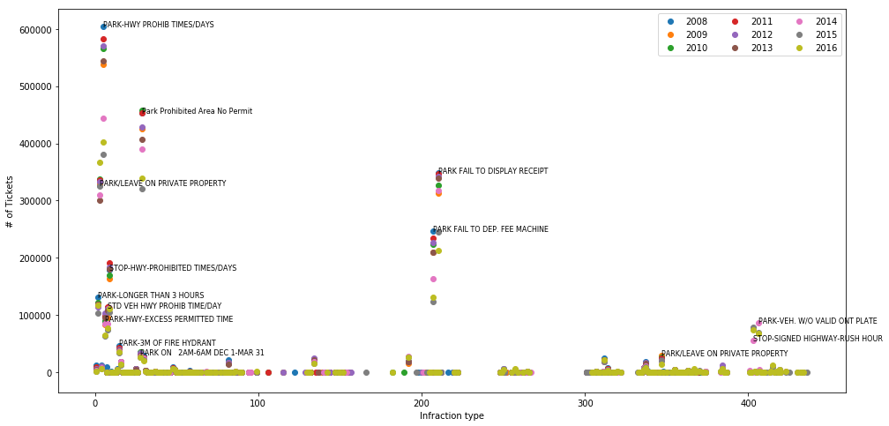
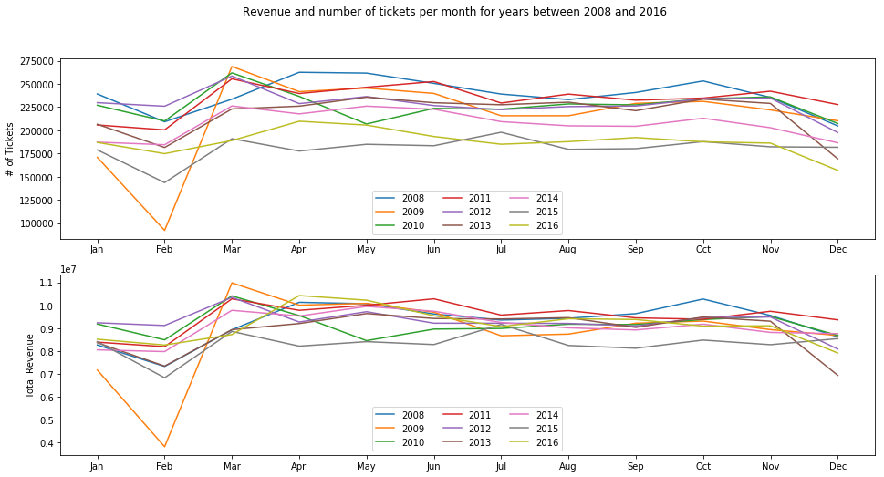
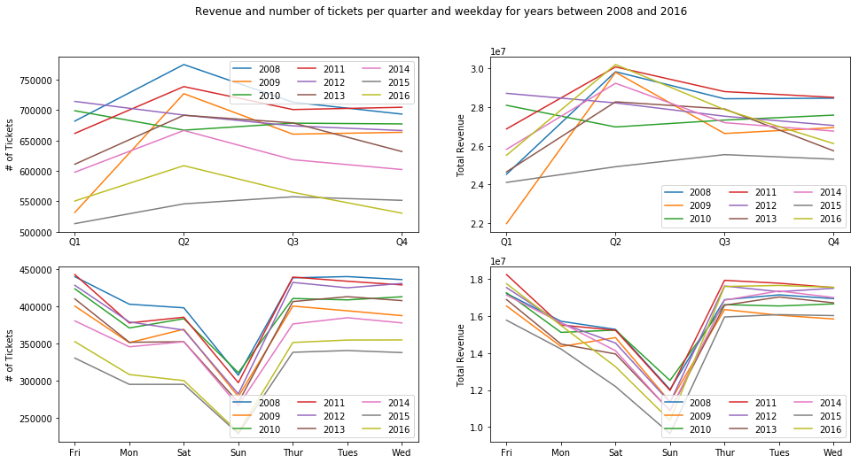
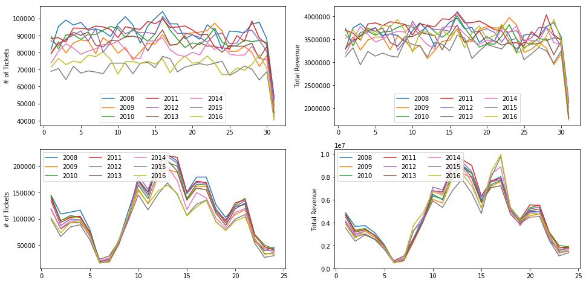
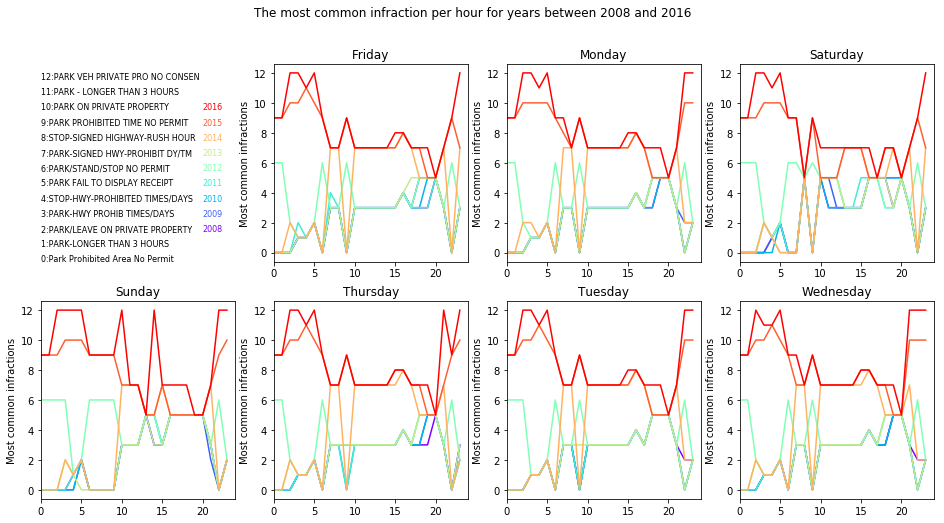
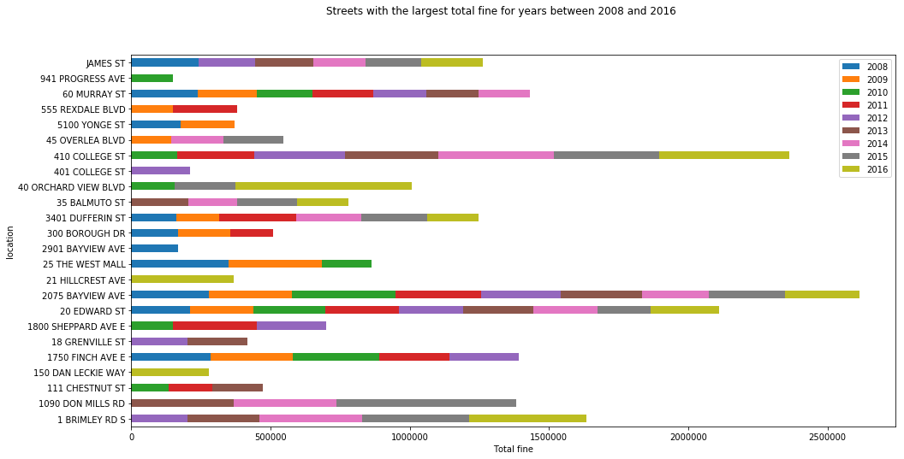

## Analysis of Toronto Parking Ticket Datasets

Revenue Services (Utility Billing, Meter Services and Parking Tags Section) and Open Data Team published the 2016 Toronto Parking Ticket Dataset on March 2017. The dataset is published annually and right now there are datasets for years between (including) 2008 and 2016. More than 2 million parking tickets are issued annually each year across the City of Toronto by Toronto Police Services (TPS) personnel as well as certified and authorized persons. Only complete records are provided and incomplete records in the City database are dropped. Toronto Open Data Team reported 

> "the volume of incomplete records relative to the overall volume is low and therefore presents insignificant impact to trend analysis."

**Datasets can be accessed [here](https://www1.toronto.ca/wps/portal/contentonly?vgnextoid=ca20256c54ea4310VgnVCM1000003dd60f89RCRD)**

The goal of this analysis is to reveal more information about the Toronto Parking Tickets. Some interesting questions are:

1. How many tickets have been issued over the last few years? How much are parking ticket revenue?
2. What's the distribution of revenue/total number of tickets per day/month/quarter/year and are these distributions predictable? What can be learned from the distributions? 
3. What are the most common infraction types? Is there any relationship between infraction type and day/month and/or the streets that the infraction happened?

Here, we use Python to analyze the datasets with the following imports.


```python
import pandas as pd
import os # for files and directories 
import numpy as np
```

##### Dataset format is as below:
- TAG_NUMBER_MASKED   First three (3) characters masked with asterisks
- DATE_OF_INFRACTION  Date the infraction occurred in YYYYMMDD format
- INFRACTION_CODE Applicable Infraction code (numeric)
- INFRACTION_DESCRIPTION  Short description of the infraction
- SET_FINE_AMOUNT Amount of set fine applicable (in dollars)
- TIME_OF_INFRACTION  Time the infraction occurred  in HHMM format (24-hr clock)
- LOCATION1   Code to denote proximity (see table below)
- LOCATION2   Street address
- LOCATION3   Code to denote proximity (optional)
- LOCATION4   Street address (optional)
- PROVINCE    Province or state code of vehicle license plate

**We do not use the following table here, but LOCATION1 is coded as below:**

- Proximity Code Table
- PROXIMITY CODE  DESCRIPTION
- AT  At
- NR  Near
- OPP Opposite
- R/O Rear of
- N/S North Side
- S/S South Side
- E/S East Side
- W/S West Side
- N/O North of
- S/O South of
- E/O East of
- W/O West of

First, *get_df* processes a given dataset (file) and returns the content as a dataframe. 
We also fix and clean the date format for future process


```python
    def get_df(fid):
        dataframe = pd.read_csv(fid, error_bad_lines=False, usecols=[1, 2, 3, 4, 5, 7, 10],
                                dtype={'time_of_infraction': str})  # Note: skip bad lines
        pat = r"\s\bAV\b"
        dataframe.location2 = dataframe.location2.str.replace(pat, ' AVE')

        # update date and time formats
        dataframe.date_of_infraction = pd.to_datetime(dataframe.date_of_infraction, format='%Y%m%d')
        dataframe['year_of_infraction'] = pd.to_datetime(dataframe.date_of_infraction, format='%Y%m%d').dt.year
        dataframe['month_of_infraction'] = pd.to_datetime(dataframe.date_of_infraction, format='%Y%m%d').dt.month
        dataframe['day_of_infraction'] = pd.to_datetime(dataframe.date_of_infraction, format='%Y%m%d').dt.day
        dataframe['quarter_of_infraction'] = pd.to_datetime(dataframe.date_of_infraction, format='%Y%m%d').dt.quarter
        dataframe['weekday_of_infraction'] = pd.to_datetime(dataframe.date_of_infraction,
                                                            format='%Y%m%d').dt.weekday_name

        dataframe.drop(['date_of_infraction'], axis=1, inplace=True)  # no longer useful

        dataframe.time_of_infraction = pd.to_datetime(dataframe['time_of_infraction'].astype(str), format='%H%M',
                                                      errors='coerce')
        dataframe['hour_of_infraction'] = pd.to_datetime(dataframe.time_of_infraction, format='%Y%m%d').dt.hour
        return dataframe
```

Now, let's apply some *groupby* operations on the dataframe to extract more useful data.
Note that the extracted columns are saved into an excel format first. The goal is to process all years first and then do some analysis. We save different things in different excel sheets. 


```python
def processTicketDS(directory, dataSet, num_of_dataset):
    outFile = dataSet[:len(dataSet) - 4] + '_Summary.xls'
    if num_of_dataset == 1:
        df = get_df(open(directory + dataSet))
    else:
        dfs = []
        for i in range(1, num_of_dataset + 1):
            dfs.append(get_df(open(directory + dataSet[:len(dataSet) - 4] + '_' + str(i) + '.csv')))
        df = pd.concat(dfs)

    writer = pd.ExcelWriter(outFile)

    data = df.groupby(['infraction_code', 'infraction_description']).size().reset_index().rename(
        columns={0: 'count'}).drop_duplicates(subset='infraction_code', keep="last")
    data.to_excel(writer, 'code_description')

    # Distribution of fines
    data = df.groupby('infraction_code').agg({'set_fine_amount': ['count', 'sum', 'max']})
    data.to_excel(writer, 'Distribution')

    # Infractions by month
    data = df.groupby(['month_of_infraction']).agg(
        {'set_fine_amount': ['count', 'sum', 'max', 'min']})
    data.to_excel(writer, 'Per_month')

    # Infractions by quarter
    data = df.groupby(['quarter_of_infraction']).agg(
        {'set_fine_amount': ['count', 'sum', 'max', 'min']})
    data.to_excel(writer, 'Per_quarter')

    # Infractions by day
    data = df.groupby(['day_of_infraction']).agg(
        {'set_fine_amount': ['count', 'sum']})
    data.to_excel(writer, 'Per_day')

    # Infractions by weekday
    data = df.groupby(['weekday_of_infraction']).agg(
        {'set_fine_amount': ['count', 'sum']})
    data.to_excel(writer, 'Per_weekday')

    # Infractions by hour
    data = df.groupby(['hour_of_infraction']).agg(
        {'set_fine_amount': ['count', 'sum']})
    data.to_excel(writer, 'Per_hour')

    data = df.groupby(['weekday_of_infraction', 'hour_of_infraction', 'infraction_code']).agg(
        {'set_fine_amount': ['count', 'sum', 'max', 'min']})
    data.to_excel(writer, 'week_hour_code')

    # Streets with the highest revenue
    data = df.groupby(['location2']).sum().set_fine_amount.sort_values(ascending=False)
    data = data[:100]
    data.to_excel(writer, 'top_streets')  # Number of Tickets Issued Decrease Slowly in Recent Years

    writer.save()
```

For 2014, 2015, and 2016 several files are provided by Toronto Open Data Team. We merge them here.


```python
directory = '../Datasets/Toronto_Parking_Tickets/CSVs/'

processTicketDS(directory, 'Parking_Tags_data_2008.csv', 1) # 1 file
processTicketDS(directory, 'Parking_Tags_data_2009.csv', 1)
processTicketDS(directory, 'Parking_Tags_data_2010.csv', 1)
processTicketDS(directory, 'Parking_Tags_data_2011.csv', 1)
processTicketDS(directory, 'Parking_Tags_Data_2012.csv', 1)
processTicketDS(directory, 'Parking_Tags_Data_2013.csv', 1)
processTicketDS(directory, 'Parking_Tags_Data_2014.csv', 4) # 4 files
processTicketDS(directory, 'Parking_Tags_Data_2015.csv', 3) # 3 files
processTicketDS(directory, 'Parking_Tags_Data_2016.csv', 4) # 4 files
```

Now, let's process the generated excel files. The goal is to get the columns and rows we want and then visualize different years together. 


```python
directory = './'
files = os.listdir(directory) # get all files

tickets = []
for file in files:
    if file.endswith('.xls'):
        xl = pd.ExcelFile(file)
        dfs = {}
        for sh in range(0, len(xl.sheet_names)):
            if 0 < sh < 8: #skip 2 header rows 
                dfs[xl.sheet_names[sh]] = xl.parse(sh, skiprows=2).values
            else:#nothing to skip
                dfs[xl.sheet_names[sh]] = xl.parse(sh, skiprows=0).values
        tickets.append(dfs)
```


```python
tickets[0]['Distribution'][0:10,:]
```


    array([[       1,   239154,  8266765,      300,        0],
           [       2,   209175,  7330300,      300,        0],
           [       3,   233518,  8932045,      450,        0],
           [       4,   262531, 10130870,      450,        0],
           [       5,   261636, 10068485,      450,        0],
           [       6,   250564,  9621415,      450,        0],
           [       7,   239036,  9356265,      450,        0],
           [       8,   233090,  9433430,      450,        0],
           [       9,   240751,  9635300,      450,        0],
           [      10,   253160, 10273850,      450,        0]], dtype=int64)


```python
tickets[0]['Per_month'][0:10,:]
```


    array([[       1,   239154,  8266765,      300,        0],
           [       2,   209175,  7330300,      300,        0],
           [       3,   233518,  8932045,      450,        0],
           [       4,   262531, 10130870,      450,        0],
           [       5,   261636, 10068485,      450,        0],
           [       6,   250564,  9621415,      450,        0],
           [       7,   239036,  9356265,      450,        0],
           [       8,   233090,  9433430,      450,        0],
           [       9,   240751,  9635300,      450,        0],
           [      10,   253160, 10273850,      450,        0]], dtype=int64)

Some constants for better visualizations ...


```python
years = [2008, 2009, 2010, 2011, 2012, 2013, 2014, 2015, 2016]
months = ['Jan', 'Feb', 'Mar', 'Apr', 'May', 'Jun', 'Jul', 'Aug', 'Sep', 'Oct', 'Nov', 'Dec']
weekdays = ['Fri', 'Mon', 'Sat', 'Sun', 'Thur', 'Tues', 'Wed']
weekdaysF = ['Friday', 'Monday', 'Saturday', 'Sunday', 'Thursday', 'Tuesday', 'Wednesday']
```

Process total revenue and total number of tickets in different years...


```python
total_revenue = []
total_tickets = []
total_large_fines = []
for year in range(0, len(tickets)):
    total_tickets.append(tickets[year]['Distribution'][:, 1].sum())
    total_revenue.append(tickets[year]['Distribution'][:, 2].sum())
    total_large_fines.append(
        tickets[year]['Distribution'][np.where(tickets[year]['Distribution'][:, 3] > 200), 1].sum())
```


```python
total_revenue
```


    [111228805,
     105339165,
     109961165,
     114226595,
     111485565,
     106554180,
     108987340,
     99872770,
     109675955]


```python
print('Y2Y revenue increase (%): \n \t', np.round(np.append([0], np.diff(total_revenue)) / total_revenue * 100, 2))
```

    Y2Y revenue increase (%): 
     	 [ 0.   -5.59  4.2   3.73 -2.46 -4.63  2.23 -9.13  8.94]

```python
total_tickets
```


    [2862776,
     2582383,
     2721462,
     2805492,
     2746154,
     2613156,
     2484983,
     2168493,
     2254760]


```python
print('Y2Y ticket increase (%): \n \t', np.round(np.append([0], np.diff(total_tickets)) / total_tickets * 100, 2))
```

    Y2Y ticket increase (%): 
     	 [  0.   -10.86   5.11   3.    -2.16  -5.09  -5.16 -14.59   3.83]

```python
total_large_fines
```


    [36806, 40696, 37595, 38345, 34792, 34872, 34400, 32927, 31611]
```python
print('Y2Y large fine increase (%): \n \t',
      np.round(np.append([0], np.diff(total_large_fines)) / total_large_fines * 100, 2))
```

    Y2Y large fine increase (%): 
     	 [  0.     9.56  -8.25   1.96 -10.21   0.23  -1.37  -4.47  -4.16]

```python
import matplotlib.pyplot as plt # to draw figures 
import matplotlib
%matplotlib inline
```

Plot total number of tickets for different years based on infraction type. 


```python
plt.figure(figsize=[16, 8])
plt.ylabel('# of Tickets')
plt.xlabel('Infraction type')
for year in range(0, len(tickets)):
    plt.scatter(tickets[year]['Distribution'][:, 0], tickets[year]['Distribution'][:, 1])

# add texts to improve visualization 
already_shown = []
for year in range(0, len(tickets)):
    sorted_ticket = np.sort(tickets[year]['Distribution'][:, 1])[::-1]
    for j in range(0, 11):
        L = np.where(tickets[year]['Distribution'][:, 1] == sorted_ticket[j])[0][0]
        if tickets[year]['Distribution'][L, 0] in already_shown:
            continue
        else:
            already_shown.append(tickets[year]['Distribution'][L, 0])
            idx = np.where(tickets[year]['code_description'][:, 0] == tickets[year]['Distribution'][L, 0])
            plt.text(tickets[year]['Distribution'][L, 0], tickets[year]['Distribution'][L, 1],
                     tickets[year]['code_description'][idx, 1][0][0], fontsize=8)

plt.legend(years, ncol=3, loc=0)
```


    <matplotlib.legend.Legend at 0xbacc0f0>



```python
sorted_ticket
```


    array([401636, 367638, 339145, 213327, 131511, 116498, 110457,  76414,
            74267,  68271,  64334,  35490,  26024,  25909,  21172,  19879,
            15933,  14687,  13334,  12787,   8385,   6567,   6320,   6254,
             6089,   6088,   5391,   4938,   4483,   4373,   3936,   3932,
             2946,   2476,   2164,   1949,   1926,   1907,   1765,   1621,
             1340,   1324,   1168,   1168,   1141,   1103,   1076,    993,
              991,    969,    920,    752,    726,    721,    627,    562,
              547,    522,    520,    327,    318,    279,    272,    230,
              215,    212,    187,    185,    185,    178,    177,    145,
              139,    135,    130,    125,    119,    111,    111,     87,
               79,     73,     72,     66,     64,     60,     58,     58,
               55,     50,     50,     49,     48,     39,     39,     37,
               36,     32,     31,     27,     26,     24,     21,     20,
               20,     19,     19,     19,     17,     16,     16,     13,
               12,     11,     11,     11,     10,      9,      9,      9,
                8,      8,      8,      8,      7,      7,      7,      6,
                6,      5,      5,      5,      4,      4,      4,      4,
                3,      3,      3,      3,      3,      3,      3,      2,
                2,      2,      2,      2,      2,      2,      2,      2,
                2,      2,      1,      1,      1,      1,      1,      1,
                1,      1,      1,      1,      1,      1,      1,      1,
                1,      1,      1,      1,      1,      1,      1,      1,
                1,      1,      1,      1], dtype=int64)

Plot total number of tickets and total revenues per month for different years. 


```python
plt.figure(figsize=[16, 8])
plt.subplot(2, 1, 1)
plt.ylabel('# of Tickets')
plt.xticks(range(1, 13), months)
for year in range(0, len(tickets)):
    plt.plot(range(1, 13), tickets[year]['Per_month'][:, 1])
plt.legend(years, ncol=3, loc=8)

plt.subplot(2, 1, 2)
plt.ylabel('Total Revenue')
plt.xticks(range(1, 13), months)
for year in range(0, len(tickets)):
    plt.plot(range(1, 13), tickets[year]['Per_month'][:, 2])
plt.legend(years, ncol=3, loc=8)
plt.suptitle('Revenue and number of tickets per month for years between 2008 and 2016')
```


    <matplotlib.text.Text at 0x12326530>





Plot total number of tickets and total revenues per weekday and quarterly for different years


```python
plt.figure(figsize=[16, 8])
plt.subplot(2, 2, 1)
plt.ylabel('# of Tickets')
plt.xticks(range(1, 5), ['Q1', 'Q2', 'Q3', 'Q4'])
for year in range(0, len(tickets)):
    plt.plot(range(1, 5), tickets[year]['Per_quarter'][:, 1])
plt.legend(years, ncol=3, loc=1)

plt.subplot(2, 2, 2)
plt.ylabel('Total Revenue')
plt.xticks(range(1, 5), ['Q1', 'Q2', 'Q3', 'Q4'])
for year in range(0, len(tickets)):
    plt.plot(range(1, 5), tickets[year]['Per_quarter'][:, 2])
plt.legend(years, ncol=3, loc=4)

plt.subplot(2, 2, 3)
plt.ylabel('# of Tickets')
plt.xticks(range(1, 8), weekdays)
for year in range(0, len(tickets)):
    plt.plot(range(1, 8), tickets[year]['Per_weekday'][:, 1])
plt.legend(years, ncol=3, loc=4)

plt.subplot(2, 2, 4)
plt.ylabel('Total Revenue')
plt.xticks(range(1, 8), weekdays)
for year in range(0, len(tickets)):
    plt.plot(range(1, 8), tickets[year]['Per_weekday'][:, 2])
plt.legend(years, ncol=3, loc=4)

plt.suptitle('Revenue and number of tickets per quarter and weekday for years between 2008 and 2016')

```


    <matplotlib.text.Text at 0x1154c250>





Plot total number of tickets and total revenues per day and per hour for different years


```python
plt.figure(figsize=[16, 8])
plt.subplot(2, 2, 1)
plt.ylabel('# of Tickets')
for year in range(0, len(tickets)):
    plt.plot(range(1, 32), tickets[year]['Per_day'][:, 1])
plt.legend(years, ncol=3, loc=8)

plt.subplot(2, 2, 2)
plt.ylabel('Total Revenue')
for year in range(0, len(tickets)):
    plt.plot(range(1, 32), tickets[year]['Per_day'][:, 2])
plt.legend(years, ncol=3, loc=8)

plt.subplot(2, 2, 3)
plt.ylabel('# of Tickets')
for year in range(0, len(tickets)):
    plt.plot(range(1, 25), tickets[year]['Per_hour'][:, 1])
plt.legend(years, ncol=3, loc=2)

plt.subplot(2, 2, 4)
plt.ylabel('Total Revenue')
for year in range(0, len(tickets)):
    plt.plot(range(1, 25), tickets[year]['Per_hour'][:, 2])
plt.legend(years, ncol=3, loc=2)

```


    <matplotlib.legend.Legend at 0x11abff10>





Let's see what are the most common infraction per hour for years between 2008 and 2016


```python
day_hr_infraction = pd.DataFrame()
for year in range(0, len(tickets)):
    for day in range(0, len(weekdaysF)):
        day_idx0 = np.where(tickets[year]['week_hour_code'][0:, :] == weekdaysF[day])[0][0] # start index
        if day == len(weekdaysF) - 1:
            day_idx1 = len(tickets[year]['week_hour_code'][0:, :])
        else:
            day_idx1 = np.where(tickets[year]['week_hour_code'][0:, :] == weekdaysF[day + 1])[0][0] #end index
        for hr in range(0, 24):
            hr_idx0 = np.where(tickets[year]['week_hour_code'][day_idx0:day_idx1, 1] == hr)[0][0] + day_idx0 #start index
            if hr == 23:
                hr_idx1 = day_idx1
            else:
                hr_idx1 = np.where(tickets[year]['week_hour_code'][day_idx0:day_idx1, 1] == (hr + 1))[0][0] + day_idx0 #end index
            max_count_idx = np.argmax(tickets[year]['week_hour_code'][hr_idx0:hr_idx1, 3]) + hr_idx0  # count
            max_count_code = tickets[year]['week_hour_code'][max_count_idx, 2] # infraction code
            idx = np.where(tickets[year]['code_description'][:, 0] == max_count_code) 
            max_count_desc = tickets[year]['code_description'][idx, 1] # infraction description 

            day_hr_infraction = day_hr_infraction.append(
                {'year': years[year], 'day': weekdaysF[day], 'hour': hr, 'code': max_count_code,
                 'desc': max_count_desc[0][0]}, ignore_index=True)

plt.figure(figsize=[16, 8])
colors = matplotlib.cm.rainbow(np.linspace(0, 1, len(years)))

lebels = day_hr_infraction.desc.unique()
plt.subplot(2, 4, 1)
plt.ylim([0, len(lebels)])
plt.xlim([0, 24])
plt.axis('off')

for i in range(0, len(lebels)):
    plt.text(0, i, str(i) + ':' + lebels[i], fontsize=8)

for day in range(0, len(weekdaysF)):
    for year in range(0, len(tickets)):
        plt.subplot(2, 4, day + 2)
        plt.xlim([0, 24])
        hours = day_hr_infraction[
            (day_hr_infraction.day == weekdaysF[day]) & (day_hr_infraction.year == years[year])].hour.values
        descp = day_hr_infraction[
            (day_hr_infraction.day == weekdaysF[day]) & (day_hr_infraction.year == years[year])].desc.values
        loc2 = np.array([-1] * 24)
        for i in range(0, len(lebels)):
            loc2[np.where(lebels[i] == descp[range(0, 24)])[0]] = i
        plt.plot(range(0, 24), loc2, c=colors[year])
        plt.title(weekdaysF[day])
        plt.ylabel('Most common infractions')
plt.suptitle('The most common infraction per hour for years between 2008 and 2016')
plt.subplot(2, 4, 1)
for i in range(0, len(tickets)):
    plt.text(20, 2 + i, str(2008 + i), color=colors[i], fontsize=8)
```





Finally, we can find streets with the largest total fines for years between 2008 and 2016


```python
top_streets = pd.DataFrame()
for year in range(0, len(tickets)):
    for street in range(0, 10):
        top_streets = top_streets.append({'year': year + 2008, 'location': tickets[year]['top_streets'][street, 0],
                                          'amount': tickets[year]['top_streets'][street, 1]}, ignore_index=True)
dfs = []
for year in range(2008, 2017):
    dfs.append(top_streets[top_streets['year'] == year].drop('year', 1).set_index('location').rename(
        columns={'amount': str(year)}))

dfs_final = pd.DataFrame()
for year in range(0, len(dfs)):
    dfs_final = dfs_final.join(dfs[year], how='outer')

dfs_final.plot.barh(stacked=True, figsize=[16, 8])
plt.xlabel('Total fine')
plt.suptitle('Streets with the largest total fine for years between 2008 and 2016')
```


    <matplotlib.text.Text at 0x957eeb0>




The code used for this document can be found [here](https://github.com/mehdi-saeedi/Data_Analysis_Py/blob/master/Toronto_Parking_Tickets.ipynb)