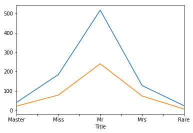

The goal of this notebook is to try a few things for the Kaggle's Titanic: Machine Learning from Disaster dataset. You can find the dataset and some information [here](https://www.kaggle.com/c/titanic). I use Python for this project. First, let's start by reading the dataset to see what we have:


```python
import pandas as pd
directory = '../../Datasets/Titanic/'
titanic_train = pd.read_csv(directory + 'train.csv')
titanic_test = pd.read_csv(directory + 'test.csv')
```


```python
titanic_train.info()
titanic_test.info()
```

    <class 'pandas.core.frame.DataFrame'>
    RangeIndex: 891 entries, 0 to 890
    Data columns (total 12 columns):
    PassengerId    891 non-null int64
    Survived       891 non-null int64
    Pclass         891 non-null int64
    Name           891 non-null object
    Sex            891 non-null object
    Age            714 non-null float64
    SibSp          891 non-null int64
    Parch          891 non-null int64
    Ticket         891 non-null object
    Fare           891 non-null float64
    Cabin          204 non-null object
    Embarked       889 non-null object
    dtypes: float64(2), int64(5), object(5)
    memory usage: 66.2+ KB
    <class 'pandas.core.frame.DataFrame'>
    RangeIndex: 418 entries, 0 to 417
    Data columns (total 11 columns):
    PassengerId    418 non-null int64
    Pclass         418 non-null int64
    Name           418 non-null object
    Sex            418 non-null object
    Age            332 non-null float64
    SibSp          418 non-null int64
    Parch          418 non-null int64
    Ticket         418 non-null object
    Fare           417 non-null float64
    Cabin          91 non-null object
    Embarked       418 non-null object
    dtypes: float64(2), int64(4), object(5)
    memory usage: 27.8+ KB


There are some missing data in Age, Cabin, and Fare. Let's combine the training and test data and fill the missing data. For now, I'll use simple methods. We can improve them later. 


```python
titanic_train_test = [titanic_train, titanic_test]
```


```python
for dataset in titanic_train_test:
    dataset['Age'].fillna(dataset.Age.median(), inplace=True)
    dataset['Cabin'].fillna('U', inplace=True)
    dataset['Embarked'].fillna('S', inplace=True)
    dataset['Fare'].fillna(dataset.Fare.mean(), inplace=True)
```


```python
titanic_train.info()
titanic_test.info()
```

    <class 'pandas.core.frame.DataFrame'>
    RangeIndex: 891 entries, 0 to 890
    Data columns (total 15 columns):
    PassengerId       891 non-null int64
    Survived          891 non-null int64
    Pclass            891 non-null int64
    Name              891 non-null object
    Sex               891 non-null object
    Age               891 non-null float64
    SibSp             891 non-null int64
    Parch             891 non-null int64
    Ticket            891 non-null object
    Fare              891 non-null float64
    Cabin             891 non-null object
    Embarked          891 non-null object
    FamilySize        891 non-null int64
    CategoricalAge    891 non-null category
    Title             891 non-null object
    dtypes: category(1), float64(2), int64(6), object(6)
    memory usage: 77.6+ KB
    <class 'pandas.core.frame.DataFrame'>
    RangeIndex: 418 entries, 0 to 417
    Data columns (total 11 columns):
    PassengerId    418 non-null int64
    Pclass         418 non-null int64
    Name           418 non-null object
    Sex            418 non-null object
    Age            418 non-null float64
    SibSp          418 non-null int64
    Parch          418 non-null int64
    Ticket         418 non-null object
    Fare           418 non-null float64
    Cabin          418 non-null object
    Embarked       418 non-null object
    dtypes: float64(2), int64(4), object(5)
    memory usage: 27.8+ KB


I'm going to define a few more columns for now. I define FamilySize (based on SibSp:# of siblings / spouses aboard the Titanic and Parch (of parents / children aboard the Titanic). 


```python
for dataset in titanic_train_test:
    dataset['FamilySize'] = dataset.SibSp + dataset.Parch
```


```python
import matplotlib.pyplot as plt
%matplotlib inline  
titanic_train.groupby('Age').count().PassengerId.plot()
```


    <matplotlib.axes._subplots.AxesSubplot at 0x8752690>


It's better to group the ages so we have a better understanding of the groups. 


```python
for dataset in titanic_train_test:
    dataset['AgeRange'], AgeBins = pd.cut(dataset['Age'], 10, retbins=True)
```


```python
titanic_train.groupby('AgeRange').count().PassengerId
```


    AgeRange
    (0.34, 8.378]        54
    (8.378, 16.336]      46
    (16.336, 24.294]    177
    (24.294, 32.252]    346
    (32.252, 40.21]     118
    (40.21, 48.168]      70
    (48.168, 56.126]     45
    (56.126, 64.084]     24
    (64.084, 72.042]      9
    (72.042, 80.0]        2
    Name: PassengerId, dtype: int64


```python
titanic_train.Name.head(10)
```


    0                              Braund, Mr. Owen Harris
    1    Cumings, Mrs. John Bradley (Florence Briggs Th...
    2                               Heikkinen, Miss. Laina
    3         Futrelle, Mrs. Jacques Heath (Lily May Peel)
    4                             Allen, Mr. William Henry
    5                                     Moran, Mr. James
    6                              McCarthy, Mr. Timothy J
    7                       Palsson, Master. Gosta Leonard
    8    Johnson, Mrs. Oscar W (Elisabeth Vilhelmina Berg)
    9                  Nasser, Mrs. Nicholas (Adele Achem)
    Name: Name, dtype: object


We can extract titles and then use it instead of Sex. Actually, there is a clear correlation between Sex and Title (Male cannot use Mrs for title). So, it doesn't make sense to keep both. As the same time, I think Title shows more information than a binary Sex variable.


```python
for dataset in titanic_train_test:
    dataset['Title'] = dataset['Name'].map(lambda name: name.split(',')[1].split('.')[0].strip())
```


```python
titanic_train.Title.head(10)
```


    0        Mr
    1       Mrs
    2      Miss
    3       Mrs
    4        Mr
    5        Mr
    6        Mr
    7    Master
    8       Mrs
    9       Mrs
    Name: Title, dtype: object


```python
plt.subplot(2,1,1)
titanic_train.groupby('Title').count().PassengerId.plot()
plt.subplot(2,1,2)
titanic_test.groupby('Title').count().PassengerId.plot()
```


    <matplotlib.axes._subplots.AxesSubplot at 0xb477910>


It make sense to just keep a few titles and get rid of the rare cases. 


```python
Title_Dictionary = {
    "Capt": "Rare",
    "Col": "Rare",
    "Major": "Rare",
    "Jonkheer": "Rare",
    "Don": "Rare",
    "Sir": "Rare",
    "Dr": "Rare",
    "Rev": "Rare",
    "the Countess": "Rare",
    "Dona": "Rare",
    "Mme": "Mrs",
    "Mlle": "Miss",
    "Ms": "Mrs",
    "Mr": "Mr",
    "Mrs": "Mrs",
    "Miss": "Miss",
    "Master": "Master",
    "Lady": "Rare"
}
for dataset in titanic_train_test:
    dataset['Title'] = dataset['Title'].map(Title_Dictionary)
```


```python
titanic_train.groupby('Title').count().PassengerId.plot()
titanic_test.groupby('Title').count().PassengerId.plot()
```


    <matplotlib.axes._subplots.AxesSubplot at 0xb1095f0>





Let's see what we can get from last name. Basically, if we can use the same last name to distinguish people from the same family, it can be useful. The problem is that some last names are common and we should not use them (see max value is 9 in the training data).


```python
for dataset in titanic_train_test:
    dataset['LastName'] = dataset['Name'].map(lambda name: name.split(',')[0].strip())
```


```python
titanic_train.groupby('LastName').count().PassengerId.describe()

```


    count    667.000000
    mean       1.335832
    std        0.854922
    min        1.000000
    25%        1.000000
    50%        1.000000
    75%        1.000000
    max        9.000000
    Name: PassengerId, dtype: float64


```python
titanic_test.groupby('LastName').count().PassengerId.describe()
```


    count    352.000000
    mean       1.187500
    std        0.505314
    min        1.000000
    25%        1.000000
    50%        1.000000
    75%        1.000000
    max        4.000000
    Name: PassengerId, dtype: float64


Let's investigate what we have from tickets, cabins, and fares. Remeber, 'U' in Cabin means unknown. The 687 value in the training data is for that one. For ticket, things are better. The max number of items with the same ticket is 7. Maybe we can use it to find groups. Obviously, same fare does not mean anything is most cases. But, it we have very few persons with the same fare, maybe they got their tickets together.


```python
titanic_train.groupby('Cabin').count().PassengerId.describe()
```


    count    148.000000
    mean       6.020270
    std       56.360775
    min        1.000000
    25%        1.000000
    50%        1.000000
    75%        2.000000
    max      687.000000
    Name: PassengerId, dtype: float64


```python
titanic_train.groupby('Ticket').count().PassengerId.describe()
```


    count    681.000000
    mean       1.308370
    std        0.792652
    min        1.000000
    25%        1.000000
    50%        1.000000
    75%        1.000000
    max        7.000000
    Name: PassengerId, dtype: float64


```python
titanic_train.groupby('Fare').count().PassengerId.describe()
```


    count    248.000000
    mean       3.592742
    std        5.848930
    min        1.000000
    25%        1.000000
    50%        2.000000
    75%        4.000000
    max       43.000000
    Name: PassengerId, dtype: float64


I think we can find the frequencies of things now to see what are the distributions. 


```python
for dataset in titanic_train_test:
    for col in ['Ticket', 'Cabin', 'Fare', 'LastName']:
        freq_col = f'Freq{col}'

        freq = dataset[col].value_counts().to_frame()
        freq.columns = [freq_col]

        dataset[freq_col] = dataset.merge(freq, how='left', left_on=col, right_index=True)[freq_col]
```


```python
titanic_train.info()
```

    <class 'pandas.core.frame.DataFrame'>
    RangeIndex: 891 entries, 0 to 890
    Data columns (total 22 columns):
    PassengerId       891 non-null int64
    Survived          891 non-null int64
    Pclass            891 non-null int64
    Name              891 non-null object
    Sex               891 non-null object
    Age               891 non-null float64
    SibSp             891 non-null int64
    Parch             891 non-null int64
    Ticket            891 non-null object
    Fare              891 non-null float64
    Cabin             891 non-null object
    Embarked          891 non-null object
    FamilySize        891 non-null int64
    CategoricalAge    891 non-null category
    Title             891 non-null object
    AgeCat            891 non-null category
    AgeRange          891 non-null category
    LastName          891 non-null object
    FreqTicket        891 non-null int64
    FreqCabin         891 non-null int64
    FreqFare          891 non-null int64
    FreqLastName      891 non-null int64
    dtypes: category(3), float64(2), int64(10), object(7)
    memory usage: 111.0+ KB


```python
titanic_train.groupby('FreqTicket').count().PassengerId.plot()
```


    <matplotlib.axes._subplots.AxesSubplot at 0xb5b9e50>


```python
titanic_train.groupby('FreqCabin').count().PassengerId
```


    FreqCabin
    1      101
    2       76
    3       15
    4       12
    687    687
    Name: PassengerId, dtype: int64


```python
titanic_train.groupby('FreqLastName').count().PassengerId.plot()
```


    <matplotlib.axes._subplots.AxesSubplot at 0xb749b10>


```python
titanic_train.groupby('FreqFare').count().PassengerId.plot()
```


    <matplotlib.axes._subplots.AxesSubplot at 0xb806e90>


Now, we can group things together. I'm going to use FamilySize first, then FreqTicket, then FreqCabin and then FreqLastName. If there is nothing, then the passanger was alone.


```python
def groupify(x):
    max_group = 5
    if x['FamilySize'] > 0:
        return x['FamilySize']
    elif x['FreqTicket'] > 1:
        return x['FreqTicket']
    elif x['FreqCabin'] > 1 and x['Cabin'] != 'U':
        return x['FreqCabin']
    elif 1 < x['FreqLastName'] < max_group:
        return x['FreqLastName']
    elif 1 < x['FreqFare'] < max_group:
        return x['FreqFare']
    else:
        return 0
```


```python
for dataset in titanic_train_test:
    dataset['GroupSize'] = dataset.apply(groupify, axis=1)
```


```python
titanic_train.groupby('GroupSize').count().PassengerId.plot()
```


    <matplotlib.axes._subplots.AxesSubplot at 0xb89b470>


Let's see what we got finally:


```python
print(titanic_train[['Pclass', 'Survived']].groupby(['Pclass'], as_index=False).mean())
print()
print(titanic_train[['GroupSize', 'Survived']].groupby(['GroupSize'], as_index=False).mean())
print()
print(titanic_train[['Embarked', 'Survived']].groupby(['Embarked'], as_index=False).mean())
print()
print(titanic_train[['AgeRange', 'Survived']].groupby(['AgeRange'], as_index=False).mean())
print()
print(titanic_train[['Title', 'Survived']].groupby(['Title'], as_index=False).mean())
print()

```

       Pclass  Survived
    0       1  0.629630
    1       2  0.472826
    2       3  0.242363
    
       GroupSize  Survived
    0          0  0.241486
    1          1  0.552795
    2          2  0.439614
    3          3  0.594937
    4          4  0.384615
    5          5  0.125000
    6          6  0.333333
    7          7  0.384615
    8         10  0.000000
    
      Embarked  Survived
    0        C  0.553571
    1        Q  0.389610
    2        S  0.339009
    
               AgeRange  Survived
    0     (0.34, 8.378]  0.666667
    1   (8.378, 16.336]  0.413043
    2  (16.336, 24.294]  0.355932
    3  (24.294, 32.252]  0.338150
    4   (32.252, 40.21]  0.440678
    5   (40.21, 48.168]  0.342857
    6  (48.168, 56.126]  0.466667
    7  (56.126, 64.084]  0.375000
    8  (64.084, 72.042]  0.000000
    9    (72.042, 80.0]  0.500000
    
        Title  Survived
    0  Master  0.575000
    1    Miss  0.701087
    2      Mr  0.156673
    3     Mrs  0.795276
    4    Rare  0.347826

​    

Let's remove the ununsed columns and clean the final dataset.


```python
y = titanic_train['Survived']
titanic_train.drop(['Survived'], axis=1, inplace=True)
```


```python
for dataset in titanic_train_test:
    dataset['Title'] = dataset['Title'].map({"Mr": 1, "Miss": 2, "Mrs": 3, "Master": 4, "Rare": 5}).astype(int)

    dataset['Embarked'] = dataset['Embarked'].map({'S': 0, 'C': 1, 'Q': 2}).astype(int)

    for AgeGroup in range(0, len(AgeBins)):
        if AgeGroup == len(AgeBins) - 1:
            dataset.loc[dataset['Age'] > AgeBins[AgeGroup], 'Age'] = AgeGroup
        else:
            dataset.loc[
                (dataset['Age'] > AgeBins[AgeGroup]) & (dataset['Age'] <= AgeBins[AgeGroup + 1]), 'Age'] = AgeGroup

    dataset["Pclass"] = dataset["Pclass"].astype('int')

    # Sex & Title have correclation. We keep Title.
    for col in dataset.columns:
        if col not in ['Pclass', 'Age', 'Embarked', 'Title', 'GroupSize']:
            dataset.drop([col], inplace=True, axis=1)
    for col in dataset.columns:
        dataset[col] = dataset[col].astype("category")
```


```python
titanic_train.columns
```


    Index(['Pclass', 'Age', 'Embarked', 'Title', 'GroupSize'], dtype='object')


As you can see, I almost remove all columns and kept the very few. I beleive that other columns are very related to the above ones and as such there will be correlation between them.

I'm going to make binary variables from these columns.


```python
titanic_train = pd.get_dummies(titanic_train, columns=None)
titanic_test = pd.get_dummies(titanic_test, columns=None)
```


```python
titanic_train.info()
```

    <class 'pandas.core.frame.DataFrame'>
    RangeIndex: 891 entries, 0 to 890
    Data columns (total 31 columns):
    Pclass_1        891 non-null uint8
    Pclass_2        891 non-null uint8
    Pclass_3        891 non-null uint8
    Age_0.0         891 non-null uint8
    Age_1.0         891 non-null uint8
    Age_2.0         891 non-null uint8
    Age_3.0         891 non-null uint8
    Age_4.0         891 non-null uint8
    Age_5.0         891 non-null uint8
    Age_6.0         891 non-null uint8
    Age_7.0         891 non-null uint8
    Age_8.0         891 non-null uint8
    Age_9.0         891 non-null uint8
    Age_10.0        891 non-null uint8
    Embarked_0      891 non-null uint8
    Embarked_1      891 non-null uint8
    Embarked_2      891 non-null uint8
    Title_1         891 non-null uint8
    Title_2         891 non-null uint8
    Title_3         891 non-null uint8
    Title_4         891 non-null uint8
    Title_5         891 non-null uint8
    GroupSize_0     891 non-null uint8
    GroupSize_1     891 non-null uint8
    GroupSize_2     891 non-null uint8
    GroupSize_3     891 non-null uint8
    GroupSize_4     891 non-null uint8
    GroupSize_5     891 non-null uint8
    GroupSize_6     891 non-null uint8
    GroupSize_7     891 non-null uint8
    GroupSize_10    891 non-null uint8
    dtypes: uint8(31)
    memory usage: 27.0 KB


To make sure we are using the same feature sets for both train and test, I need to clean the dataset a little more.


```python
missing_cols = set(titanic_train.columns) - set(titanic_test.columns)
for c in missing_cols:
    titanic_test[c] = 0
missing_cols = set(titanic_test.columns) - set(titanic_train.columns)
for c in missing_cols:
    titanic_test[c] = 0
```


```python
X_train, y_train = titanic_train, y
X_test = titanic_test
```

I'm going to try a few classifiers with different paramters (cross validation)


```python
from sklearn.model_selection import StratifiedShuffleSplit

# Set the parameters by cross-validation
cv = StratifiedShuffleSplit(n_splits=5, test_size=0.2, random_state=0)
```


```python
from sklearn.model_selection import GridSearchCV
from sklearn import svm
import numpy as np

# run svm
C_range = np.logspace(-3, 3, 7)
gamma_range = np.logspace(-3, 3, 7)
param_grid = dict(gamma=gamma_range, C=C_range)
svm_model = GridSearchCV(svm.SVC(), param_grid=param_grid, cv=cv)
svm_model.fit(X_train, y_train)
```


    GridSearchCV(cv=StratifiedShuffleSplit(n_splits=5, random_state=0, test_size=0.2,
                train_size=None),
           error_score='raise',
           estimator=SVC(C=1.0, cache_size=200, class_weight=None, coef0=0.0,
      decision_function_shape='ovr', degree=3, gamma='auto', kernel='rbf',
      max_iter=-1, probability=False, random_state=None, shrinking=True,
      tol=0.001, verbose=False),
           fit_params=None, iid=True, n_jobs=1,
           param_grid={'gamma': array([  1.00000e-03,   1.00000e-02,   1.00000e-01,   1.00000e+00,
             1.00000e+01,   1.00000e+02,   1.00000e+03]), 'C': array([  1.00000e-03,   1.00000e-02,   1.00000e-01,   1.00000e+00,
             1.00000e+01,   1.00000e+02,   1.00000e+03])},
           pre_dispatch='2*n_jobs', refit=True, return_train_score=True,
           scoring=None, verbose=0)


```python
print("[SVM] The best parameters are %s with a score of %0.2f"
      % (svm_model.best_params_, svm_model.best_score_))
```

    [SVM] The best parameters are {'C': 1.0, 'gamma': 0.10000000000000001} with a score of 0.82
​    

Now, let's try Multi-layer Perceptron.


```python
from sklearn.neural_network import MLPClassifier

# MLP
alpha_range = np.logspace(-3, 3, 7)
param_grid = dict(alpha=alpha_range)
mlp = GridSearchCV(MLPClassifier(solver='lbfgs'), param_grid=param_grid, cv=cv)
mlp.fit(X_train, y_train)
```


    GridSearchCV(cv=StratifiedShuffleSplit(n_splits=5, random_state=0, test_size=0.2,
                train_size=None),
           error_score='raise',
           estimator=MLPClassifier(activation='relu', alpha=0.0001, batch_size='auto', beta_1=0.9,
           beta_2=0.999, early_stopping=False, epsilon=1e-08,
           hidden_layer_sizes=(100,), learning_rate='constant',
           learning_rate_init=0.001, max_iter=200, momentum=0.9,
           nesterovs_momentum=True, power_t=0.5, random_state=None,
           shuffle=True, solver='lbfgs', tol=0.0001, validation_fraction=0.1,
           verbose=False, warm_start=False),
           fit_params=None, iid=True, n_jobs=1,
           param_grid={'alpha': array([  1.00000e-03,   1.00000e-02,   1.00000e-01,   1.00000e+00,
             1.00000e+01,   1.00000e+02,   1.00000e+03])},
           pre_dispatch='2*n_jobs', refit=True, return_train_score=True,
           scoring=None, verbose=0)


```python
print("[MLP] The best parameters are %s with a score of %0.2f"
      % (mlp.best_params_, mlp.best_score_))
```

    [MLP] The best parameters are {'alpha': 10.0} with a score of 0.81
​    


```python
from sklearn.tree import DecisionTreeClassifier

# Tree
max_depth_range = np.linspace(10, 15, 6).astype(int)
min_samples_split_range = np.linspace(2, 5, 4).astype(int)
param_grid = dict(max_depth=max_depth_range, min_samples_split=min_samples_split_range)
clf = GridSearchCV(DecisionTreeClassifier(), param_grid=param_grid, cv=cv)
clf.fit(X_train, y_train)

```


    GridSearchCV(cv=StratifiedShuffleSplit(n_splits=5, random_state=0, test_size=0.2,
                train_size=None),
           error_score='raise',
           estimator=DecisionTreeClassifier(class_weight=None, criterion='gini', max_depth=None,
                max_features=None, max_leaf_nodes=None,
                min_impurity_decrease=0.0, min_impurity_split=None,
                min_samples_leaf=1, min_samples_split=2,
                min_weight_fraction_leaf=0.0, presort=False, random_state=None,
                splitter='best'),
           fit_params=None, iid=True, n_jobs=1,
           param_grid={'max_depth': array([10, 11, 12, 13, 14, 15]), 'min_samples_split': array([2, 3, 4, 5])},
           pre_dispatch='2*n_jobs', refit=True, return_train_score=True,
           scoring=None, verbose=0)


```python
print("[TREE] The best parameters are %s with a score of %0.2f"
      % (clf.best_params_, clf.best_score_))
```

    [TREE] The best parameters are {'max_depth': 10, 'min_samples_split': 3} with a score of 0.81
​    


```python
from sklearn.ensemble import RandomForestClassifier

# Random Forest
param_grid = {"n_estimators": [250, 300],
              "criterion": ["gini", "entropy"],
              "max_depth": [10, 15, 20],
              "min_samples_split": [2, 3, 4]}
cv = StratifiedShuffleSplit(n_splits=5, test_size=0.2, random_state=0)
forest = GridSearchCV(RandomForestClassifier(), param_grid=param_grid, cv=cv, verbose=2)
forest.fit(X_train, y_train)

```

    Fitting 5 folds for each of 36 candidates, totalling 180 fits
    [CV] criterion=gini, max_depth=10, min_samples_split=2, n_estimators=250 
    [CV]  criterion=gini, max_depth=10, min_samples_split=2, n_estimators=250, total=   0.5s
    [CV] criterion=gini, max_depth=10, min_samples_split=2, n_estimators=250 


    [Parallel(n_jobs=1)]: Done   1 out of   1 | elapsed:    0.5s remaining:    0.0s
​    

    [CV]  criterion=gini, max_depth=10, min_samples_split=2, n_estimators=250, total=   0.5s
    [CV] criterion=gini, max_depth=10, min_samples_split=2, n_estimators=250 
    [CV]  criterion=gini, max_depth=10, min_samples_split=2, n_estimators=250, total=   0.5s
    [CV] criterion=gini, max_depth=10, min_samples_split=2, n_estimators=250 
    [CV]  criterion=gini, max_depth=10, min_samples_split=2, n_estimators=250, total=   0.5s
    [CV] criterion=gini, max_depth=10, min_samples_split=2, n_estimators=250 
    [CV]  criterion=gini, max_depth=10, min_samples_split=2, n_estimators=250, total=   0.5s
    [CV] criterion=gini, max_depth=10, min_samples_split=2, n_estimators=300 
    [CV]  criterion=gini, max_depth=10, min_samples_split=2, n_estimators=300, total=   0.6s
    [CV] criterion=gini, max_depth=10, min_samples_split=2, n_estimators=300 
    [CV]  criterion=gini, max_depth=10, min_samples_split=2, n_estimators=300, total=   0.6s
    [CV] criterion=gini, max_depth=10, min_samples_split=2, n_estimators=300 
    [CV]  criterion=gini, max_depth=10, min_samples_split=2, n_estimators=300, total=   0.6s
    [CV] criterion=gini, max_depth=10, min_samples_split=2, n_estimators=300 
    [CV]  criterion=gini, max_depth=10, min_samples_split=2, n_estimators=300, total=   0.6s
    [CV] criterion=gini, max_depth=10, min_samples_split=2, n_estimators=300 
    [CV]  criterion=gini, max_depth=10, min_samples_split=2, n_estimators=300, total=   0.6s
    [CV] criterion=gini, max_depth=10, min_samples_split=3, n_estimators=250 
    [CV]  criterion=gini, max_depth=10, min_samples_split=3, n_estimators=250, total=   0.5s
    [CV] criterion=gini, max_depth=10, min_samples_split=3, n_estimators=250 
    [CV]  criterion=gini, max_depth=10, min_samples_split=3, n_estimators=250, total=   0.5s
    [CV] criterion=gini, max_depth=10, min_samples_split=3, n_estimators=250 
    [CV]  criterion=gini, max_depth=10, min_samples_split=3, n_estimators=250, total=   0.5s
    [CV] criterion=gini, max_depth=10, min_samples_split=3, n_estimators=250 
    [CV]  criterion=gini, max_depth=10, min_samples_split=3, n_estimators=250, total=   0.5s
    [CV] criterion=gini, max_depth=10, min_samples_split=3, n_estimators=250 
    [CV]  criterion=gini, max_depth=10, min_samples_split=3, n_estimators=250, total=   0.5s
    [CV] criterion=gini, max_depth=10, min_samples_split=3, n_estimators=300 
    [CV]  criterion=gini, max_depth=10, min_samples_split=3, n_estimators=300, total=   0.5s
    [CV] criterion=gini, max_depth=10, min_samples_split=3, n_estimators=300 
    [CV]  criterion=gini, max_depth=10, min_samples_split=3, n_estimators=300, total=   0.6s
    [CV] criterion=gini, max_depth=10, min_samples_split=3, n_estimators=300 
    [CV]  criterion=gini, max_depth=10, min_samples_split=3, n_estimators=300, total=   0.6s
    [CV] criterion=gini, max_depth=10, min_samples_split=3, n_estimators=300 
    [CV]  criterion=gini, max_depth=10, min_samples_split=3, n_estimators=300, total=   0.6s
    [CV] criterion=gini, max_depth=10, min_samples_split=3, n_estimators=300 
    [CV]  criterion=gini, max_depth=10, min_samples_split=3, n_estimators=300, total=   0.6s
    [CV] criterion=gini, max_depth=10, min_samples_split=4, n_estimators=250 
    [CV]  criterion=gini, max_depth=10, min_samples_split=4, n_estimators=250, total=   0.5s
    [CV] criterion=gini, max_depth=10, min_samples_split=4, n_estimators=250 
    [CV]  criterion=gini, max_depth=10, min_samples_split=4, n_estimators=250, total=   0.5s
    [CV] criterion=gini, max_depth=10, min_samples_split=4, n_estimators=250 
    [CV]  criterion=gini, max_depth=10, min_samples_split=4, n_estimators=250, total=   0.5s
    [CV] criterion=gini, max_depth=10, min_samples_split=4, n_estimators=250 
    [CV]  criterion=gini, max_depth=10, min_samples_split=4, n_estimators=250, total=   0.5s
    [CV] criterion=gini, max_depth=10, min_samples_split=4, n_estimators=250 
    [CV]  criterion=gini, max_depth=10, min_samples_split=4, n_estimators=250, total=   0.5s
    [CV] criterion=gini, max_depth=10, min_samples_split=4, n_estimators=300 
    [CV]  criterion=gini, max_depth=10, min_samples_split=4, n_estimators=300, total=   0.6s
    [CV] criterion=gini, max_depth=10, min_samples_split=4, n_estimators=300 
    [CV]  criterion=gini, max_depth=10, min_samples_split=4, n_estimators=300, total=   0.6s
    [CV] criterion=gini, max_depth=10, min_samples_split=4, n_estimators=300 
    [CV]  criterion=gini, max_depth=10, min_samples_split=4, n_estimators=300, total=   0.6s
    [CV] criterion=gini, max_depth=10, min_samples_split=4, n_estimators=300 
    [CV]  criterion=gini, max_depth=10, min_samples_split=4, n_estimators=300, total=   0.6s
    [CV] criterion=gini, max_depth=10, min_samples_split=4, n_estimators=300 
    [CV]  criterion=gini, max_depth=10, min_samples_split=4, n_estimators=300, total=   0.7s
    [CV] criterion=gini, max_depth=15, min_samples_split=2, n_estimators=250 
    [CV]  criterion=gini, max_depth=15, min_samples_split=2, n_estimators=250, total=   0.5s
    [CV] criterion=gini, max_depth=15, min_samples_split=2, n_estimators=250 
    [CV]  criterion=gini, max_depth=15, min_samples_split=2, n_estimators=250, total=   0.5s
    [CV] criterion=gini, max_depth=15, min_samples_split=2, n_estimators=250 
    [CV]  criterion=gini, max_depth=15, min_samples_split=2, n_estimators=250, total=   0.5s
    [CV] criterion=gini, max_depth=15, min_samples_split=2, n_estimators=250 
    [CV]  criterion=gini, max_depth=15, min_samples_split=2, n_estimators=250, total=   0.5s
    [CV] criterion=gini, max_depth=15, min_samples_split=2, n_estimators=250 
    [CV]  criterion=gini, max_depth=15, min_samples_split=2, n_estimators=250, total=   0.5s
    [CV] criterion=gini, max_depth=15, min_samples_split=2, n_estimators=300 
    [CV]  criterion=gini, max_depth=15, min_samples_split=2, n_estimators=300, total=   0.6s
    [CV] criterion=gini, max_depth=15, min_samples_split=2, n_estimators=300 
    [CV]  criterion=gini, max_depth=15, min_samples_split=2, n_estimators=300, total=   0.6s
    [CV] criterion=gini, max_depth=15, min_samples_split=2, n_estimators=300 
    [CV]  criterion=gini, max_depth=15, min_samples_split=2, n_estimators=300, total=   0.6s
    [CV] criterion=gini, max_depth=15, min_samples_split=2, n_estimators=300 
    [CV]  criterion=gini, max_depth=15, min_samples_split=2, n_estimators=300, total=   0.6s
    [CV] criterion=gini, max_depth=15, min_samples_split=2, n_estimators=300 
    [CV]  criterion=gini, max_depth=15, min_samples_split=2, n_estimators=300, total=   0.6s
    [CV] criterion=gini, max_depth=15, min_samples_split=3, n_estimators=250 
    [CV]  criterion=gini, max_depth=15, min_samples_split=3, n_estimators=250, total=   0.5s
    [CV] criterion=gini, max_depth=15, min_samples_split=3, n_estimators=250 
    [CV]  criterion=gini, max_depth=15, min_samples_split=3, n_estimators=250, total=   0.5s
    [CV] criterion=gini, max_depth=15, min_samples_split=3, n_estimators=250 
    [CV]  criterion=gini, max_depth=15, min_samples_split=3, n_estimators=250, total=   0.5s
    [CV] criterion=gini, max_depth=15, min_samples_split=3, n_estimators=250 
    [CV]  criterion=gini, max_depth=15, min_samples_split=3, n_estimators=250, total=   0.5s
    [CV] criterion=gini, max_depth=15, min_samples_split=3, n_estimators=250 
    [CV]  criterion=gini, max_depth=15, min_samples_split=3, n_estimators=250, total=   0.5s
    [CV] criterion=gini, max_depth=15, min_samples_split=3, n_estimators=300 
    [CV]  criterion=gini, max_depth=15, min_samples_split=3, n_estimators=300, total=   0.6s
    [CV] criterion=gini, max_depth=15, min_samples_split=3, n_estimators=300 
    [CV]  criterion=gini, max_depth=15, min_samples_split=3, n_estimators=300, total=   0.6s
    [CV] criterion=gini, max_depth=15, min_samples_split=3, n_estimators=300 
    [CV]  criterion=gini, max_depth=15, min_samples_split=3, n_estimators=300, total=   0.6s
    [CV] criterion=gini, max_depth=15, min_samples_split=3, n_estimators=300 
    [CV]  criterion=gini, max_depth=15, min_samples_split=3, n_estimators=300, total=   0.7s
    [CV] criterion=gini, max_depth=15, min_samples_split=3, n_estimators=300 
    [CV]  criterion=gini, max_depth=15, min_samples_split=3, n_estimators=300, total=   0.6s
    [CV] criterion=gini, max_depth=15, min_samples_split=4, n_estimators=250 
    [CV]  criterion=gini, max_depth=15, min_samples_split=4, n_estimators=250, total=   0.5s
    [CV] criterion=gini, max_depth=15, min_samples_split=4, n_estimators=250 
    [CV]  criterion=gini, max_depth=15, min_samples_split=4, n_estimators=250, total=   0.6s
    [CV] criterion=gini, max_depth=15, min_samples_split=4, n_estimators=250 
    [CV]  criterion=gini, max_depth=15, min_samples_split=4, n_estimators=250, total=   0.5s
    [CV] criterion=gini, max_depth=15, min_samples_split=4, n_estimators=250 
    [CV]  criterion=gini, max_depth=15, min_samples_split=4, n_estimators=250, total=   0.5s
    [CV] criterion=gini, max_depth=15, min_samples_split=4, n_estimators=250 
    [CV]  criterion=gini, max_depth=15, min_samples_split=4, n_estimators=250, total=   0.5s
    [CV] criterion=gini, max_depth=15, min_samples_split=4, n_estimators=300 
    [CV]  criterion=gini, max_depth=15, min_samples_split=4, n_estimators=300, total=   0.6s
    [CV] criterion=gini, max_depth=15, min_samples_split=4, n_estimators=300 
    [CV]  criterion=gini, max_depth=15, min_samples_split=4, n_estimators=300, total=   0.6s
    [CV] criterion=gini, max_depth=15, min_samples_split=4, n_estimators=300 
    [CV]  criterion=gini, max_depth=15, min_samples_split=4, n_estimators=300, total=   0.7s
    [CV] criterion=gini, max_depth=15, min_samples_split=4, n_estimators=300 
    [CV]  criterion=gini, max_depth=15, min_samples_split=4, n_estimators=300, total=   0.6s
    [CV] criterion=gini, max_depth=15, min_samples_split=4, n_estimators=300 
    [CV]  criterion=gini, max_depth=15, min_samples_split=4, n_estimators=300, total=   0.6s
    [CV] criterion=gini, max_depth=20, min_samples_split=2, n_estimators=250 
    [CV]  criterion=gini, max_depth=20, min_samples_split=2, n_estimators=250, total=   0.5s
    [CV] criterion=gini, max_depth=20, min_samples_split=2, n_estimators=250 
    [CV]  criterion=gini, max_depth=20, min_samples_split=2, n_estimators=250, total=   0.5s
    [CV] criterion=gini, max_depth=20, min_samples_split=2, n_estimators=250 
    [CV]  criterion=gini, max_depth=20, min_samples_split=2, n_estimators=250, total=   0.5s
    [CV] criterion=gini, max_depth=20, min_samples_split=2, n_estimators=250 
    [CV]  criterion=gini, max_depth=20, min_samples_split=2, n_estimators=250, total=   0.5s
    [CV] criterion=gini, max_depth=20, min_samples_split=2, n_estimators=250 
    [CV]  criterion=gini, max_depth=20, min_samples_split=2, n_estimators=250, total=   0.5s
    [CV] criterion=gini, max_depth=20, min_samples_split=2, n_estimators=300 
    [CV]  criterion=gini, max_depth=20, min_samples_split=2, n_estimators=300, total=   0.7s
    [CV] criterion=gini, max_depth=20, min_samples_split=2, n_estimators=300 
    [CV]  criterion=gini, max_depth=20, min_samples_split=2, n_estimators=300, total=   0.7s
    [CV] criterion=gini, max_depth=20, min_samples_split=2, n_estimators=300 
    [CV]  criterion=gini, max_depth=20, min_samples_split=2, n_estimators=300, total=   0.8s
    [CV] criterion=gini, max_depth=20, min_samples_split=2, n_estimators=300 
    [CV]  criterion=gini, max_depth=20, min_samples_split=2, n_estimators=300, total=   0.8s
    [CV] criterion=gini, max_depth=20, min_samples_split=2, n_estimators=300 
    [CV]  criterion=gini, max_depth=20, min_samples_split=2, n_estimators=300, total=   0.8s
    [CV] criterion=gini, max_depth=20, min_samples_split=3, n_estimators=250 
    [CV]  criterion=gini, max_depth=20, min_samples_split=3, n_estimators=250, total=   0.7s
    [CV] criterion=gini, max_depth=20, min_samples_split=3, n_estimators=250 
    [CV]  criterion=gini, max_depth=20, min_samples_split=3, n_estimators=250, total=   0.7s
    [CV] criterion=gini, max_depth=20, min_samples_split=3, n_estimators=250 
    [CV]  criterion=gini, max_depth=20, min_samples_split=3, n_estimators=250, total=   0.9s
    [CV] criterion=gini, max_depth=20, min_samples_split=3, n_estimators=250 
    [CV]  criterion=gini, max_depth=20, min_samples_split=3, n_estimators=250, total=   0.6s
    [CV] criterion=gini, max_depth=20, min_samples_split=3, n_estimators=250 
    [CV]  criterion=gini, max_depth=20, min_samples_split=3, n_estimators=250, total=   0.6s
    [CV] criterion=gini, max_depth=20, min_samples_split=3, n_estimators=300 
    [CV]  criterion=gini, max_depth=20, min_samples_split=3, n_estimators=300, total=   1.1s
    [CV] criterion=gini, max_depth=20, min_samples_split=3, n_estimators=300 
    [CV]  criterion=gini, max_depth=20, min_samples_split=3, n_estimators=300, total=   0.9s
    [CV] criterion=gini, max_depth=20, min_samples_split=3, n_estimators=300 
    [CV]  criterion=gini, max_depth=20, min_samples_split=3, n_estimators=300, total=   1.0s
    [CV] criterion=gini, max_depth=20, min_samples_split=3, n_estimators=300 
    [CV]  criterion=gini, max_depth=20, min_samples_split=3, n_estimators=300, total=   0.8s
    [CV] criterion=gini, max_depth=20, min_samples_split=3, n_estimators=300 
    [CV]  criterion=gini, max_depth=20, min_samples_split=3, n_estimators=300, total=   0.8s
    [CV] criterion=gini, max_depth=20, min_samples_split=4, n_estimators=250 
    [CV]  criterion=gini, max_depth=20, min_samples_split=4, n_estimators=250, total=   0.7s
    [CV] criterion=gini, max_depth=20, min_samples_split=4, n_estimators=250 
    [CV]  criterion=gini, max_depth=20, min_samples_split=4, n_estimators=250, total=   0.6s
    [CV] criterion=gini, max_depth=20, min_samples_split=4, n_estimators=250 
    [CV]  criterion=gini, max_depth=20, min_samples_split=4, n_estimators=250, total=   0.7s
    [CV] criterion=gini, max_depth=20, min_samples_split=4, n_estimators=250 
    [CV]  criterion=gini, max_depth=20, min_samples_split=4, n_estimators=250, total=   0.7s
    [CV] criterion=gini, max_depth=20, min_samples_split=4, n_estimators=250 
    [CV]  criterion=gini, max_depth=20, min_samples_split=4, n_estimators=250, total=   0.7s
    [CV] criterion=gini, max_depth=20, min_samples_split=4, n_estimators=300 
    [CV]  criterion=gini, max_depth=20, min_samples_split=4, n_estimators=300, total=   0.8s
    [CV] criterion=gini, max_depth=20, min_samples_split=4, n_estimators=300 
    [CV]  criterion=gini, max_depth=20, min_samples_split=4, n_estimators=300, total=   0.8s
    [CV] criterion=gini, max_depth=20, min_samples_split=4, n_estimators=300 
    [CV]  criterion=gini, max_depth=20, min_samples_split=4, n_estimators=300, total=   0.9s
    [CV] criterion=gini, max_depth=20, min_samples_split=4, n_estimators=300 
    [CV]  criterion=gini, max_depth=20, min_samples_split=4, n_estimators=300, total=   0.8s
    [CV] criterion=gini, max_depth=20, min_samples_split=4, n_estimators=300 
    [CV]  criterion=gini, max_depth=20, min_samples_split=4, n_estimators=300, total=   0.8s
    [CV] criterion=entropy, max_depth=10, min_samples_split=2, n_estimators=250 
    [CV]  criterion=entropy, max_depth=10, min_samples_split=2, n_estimators=250, total=   0.6s
    [CV] criterion=entropy, max_depth=10, min_samples_split=2, n_estimators=250 
    [CV]  criterion=entropy, max_depth=10, min_samples_split=2, n_estimators=250, total=   0.7s
    [CV] criterion=entropy, max_depth=10, min_samples_split=2, n_estimators=250 
    [CV]  criterion=entropy, max_depth=10, min_samples_split=2, n_estimators=250, total=   0.6s
    [CV] criterion=entropy, max_depth=10, min_samples_split=2, n_estimators=250 
    [CV]  criterion=entropy, max_depth=10, min_samples_split=2, n_estimators=250, total=   0.7s
    [CV] criterion=entropy, max_depth=10, min_samples_split=2, n_estimators=250 
    [CV]  criterion=entropy, max_depth=10, min_samples_split=2, n_estimators=250, total=   0.7s
    [CV] criterion=entropy, max_depth=10, min_samples_split=2, n_estimators=300 
    [CV]  criterion=entropy, max_depth=10, min_samples_split=2, n_estimators=300, total=   0.9s
    [CV] criterion=entropy, max_depth=10, min_samples_split=2, n_estimators=300 
    [CV]  criterion=entropy, max_depth=10, min_samples_split=2, n_estimators=300, total=   0.8s
    [CV] criterion=entropy, max_depth=10, min_samples_split=2, n_estimators=300 
    [CV]  criterion=entropy, max_depth=10, min_samples_split=2, n_estimators=300, total=   0.8s
    [CV] criterion=entropy, max_depth=10, min_samples_split=2, n_estimators=300 
    [CV]  criterion=entropy, max_depth=10, min_samples_split=2, n_estimators=300, total=   0.9s
    [CV] criterion=entropy, max_depth=10, min_samples_split=2, n_estimators=300 
    [CV]  criterion=entropy, max_depth=10, min_samples_split=2, n_estimators=300, total=   0.8s
    [CV] criterion=entropy, max_depth=10, min_samples_split=3, n_estimators=250 
    [CV]  criterion=entropy, max_depth=10, min_samples_split=3, n_estimators=250, total=   0.6s
    [CV] criterion=entropy, max_depth=10, min_samples_split=3, n_estimators=250 
    [CV]  criterion=entropy, max_depth=10, min_samples_split=3, n_estimators=250, total=   0.6s
    [CV] criterion=entropy, max_depth=10, min_samples_split=3, n_estimators=250 
    [CV]  criterion=entropy, max_depth=10, min_samples_split=3, n_estimators=250, total=   0.7s
    [CV] criterion=entropy, max_depth=10, min_samples_split=3, n_estimators=250 
    [CV]  criterion=entropy, max_depth=10, min_samples_split=3, n_estimators=250, total=   0.7s
    [CV] criterion=entropy, max_depth=10, min_samples_split=3, n_estimators=250 
    [CV]  criterion=entropy, max_depth=10, min_samples_split=3, n_estimators=250, total=   0.7s
    [CV] criterion=entropy, max_depth=10, min_samples_split=3, n_estimators=300 
    [CV]  criterion=entropy, max_depth=10, min_samples_split=3, n_estimators=300, total=   0.8s
    [CV] criterion=entropy, max_depth=10, min_samples_split=3, n_estimators=300 
    [CV]  criterion=entropy, max_depth=10, min_samples_split=3, n_estimators=300, total=   0.8s
    [CV] criterion=entropy, max_depth=10, min_samples_split=3, n_estimators=300 
    [CV]  criterion=entropy, max_depth=10, min_samples_split=3, n_estimators=300, total=   0.9s
    [CV] criterion=entropy, max_depth=10, min_samples_split=3, n_estimators=300 
    [CV]  criterion=entropy, max_depth=10, min_samples_split=3, n_estimators=300, total=   0.9s
    [CV] criterion=entropy, max_depth=10, min_samples_split=3, n_estimators=300 
    [CV]  criterion=entropy, max_depth=10, min_samples_split=3, n_estimators=300, total=   0.8s
    [CV] criterion=entropy, max_depth=10, min_samples_split=4, n_estimators=250 
    [CV]  criterion=entropy, max_depth=10, min_samples_split=4, n_estimators=250, total=   0.6s
    [CV] criterion=entropy, max_depth=10, min_samples_split=4, n_estimators=250 
    [CV]  criterion=entropy, max_depth=10, min_samples_split=4, n_estimators=250, total=   0.7s
    [CV] criterion=entropy, max_depth=10, min_samples_split=4, n_estimators=250 
    [CV]  criterion=entropy, max_depth=10, min_samples_split=4, n_estimators=250, total=   0.6s
    [CV] criterion=entropy, max_depth=10, min_samples_split=4, n_estimators=250 
    [CV]  criterion=entropy, max_depth=10, min_samples_split=4, n_estimators=250, total=   0.6s
    [CV] criterion=entropy, max_depth=10, min_samples_split=4, n_estimators=250 
    [CV]  criterion=entropy, max_depth=10, min_samples_split=4, n_estimators=250, total=   0.7s
    [CV] criterion=entropy, max_depth=10, min_samples_split=4, n_estimators=300 
    [CV]  criterion=entropy, max_depth=10, min_samples_split=4, n_estimators=300, total=   0.9s
    [CV] criterion=entropy, max_depth=10, min_samples_split=4, n_estimators=300 
    [CV]  criterion=entropy, max_depth=10, min_samples_split=4, n_estimators=300, total=   0.8s
    [CV] criterion=entropy, max_depth=10, min_samples_split=4, n_estimators=300 
    [CV]  criterion=entropy, max_depth=10, min_samples_split=4, n_estimators=300, total=   0.8s
    [CV] criterion=entropy, max_depth=10, min_samples_split=4, n_estimators=300 
    [CV]  criterion=entropy, max_depth=10, min_samples_split=4, n_estimators=300, total=   0.8s
    [CV] criterion=entropy, max_depth=10, min_samples_split=4, n_estimators=300 
    [CV]  criterion=entropy, max_depth=10, min_samples_split=4, n_estimators=300, total=   0.8s
    [CV] criterion=entropy, max_depth=15, min_samples_split=2, n_estimators=250 
    [CV]  criterion=entropy, max_depth=15, min_samples_split=2, n_estimators=250, total=   0.7s
    [CV] criterion=entropy, max_depth=15, min_samples_split=2, n_estimators=250 
    [CV]  criterion=entropy, max_depth=15, min_samples_split=2, n_estimators=250, total=   0.8s
    [CV] criterion=entropy, max_depth=15, min_samples_split=2, n_estimators=250 
    [CV]  criterion=entropy, max_depth=15, min_samples_split=2, n_estimators=250, total=   0.8s
    [CV] criterion=entropy, max_depth=15, min_samples_split=2, n_estimators=250 
    [CV]  criterion=entropy, max_depth=15, min_samples_split=2, n_estimators=250, total=   0.8s
    [CV] criterion=entropy, max_depth=15, min_samples_split=2, n_estimators=250 
    [CV]  criterion=entropy, max_depth=15, min_samples_split=2, n_estimators=250, total=   0.8s
    [CV] criterion=entropy, max_depth=15, min_samples_split=2, n_estimators=300 
    [CV]  criterion=entropy, max_depth=15, min_samples_split=2, n_estimators=300, total=   0.9s
    [CV] criterion=entropy, max_depth=15, min_samples_split=2, n_estimators=300 
    [CV]  criterion=entropy, max_depth=15, min_samples_split=2, n_estimators=300, total=   0.9s
    [CV] criterion=entropy, max_depth=15, min_samples_split=2, n_estimators=300 
    [CV]  criterion=entropy, max_depth=15, min_samples_split=2, n_estimators=300, total=   0.8s
    [CV] criterion=entropy, max_depth=15, min_samples_split=2, n_estimators=300 
    [CV]  criterion=entropy, max_depth=15, min_samples_split=2, n_estimators=300, total=   0.8s
    [CV] criterion=entropy, max_depth=15, min_samples_split=2, n_estimators=300 
    [CV]  criterion=entropy, max_depth=15, min_samples_split=2, n_estimators=300, total=   0.9s
    [CV] criterion=entropy, max_depth=15, min_samples_split=3, n_estimators=250 
    [CV]  criterion=entropy, max_depth=15, min_samples_split=3, n_estimators=250, total=   0.7s
    [CV] criterion=entropy, max_depth=15, min_samples_split=3, n_estimators=250 
    [CV]  criterion=entropy, max_depth=15, min_samples_split=3, n_estimators=250, total=   0.8s
    [CV] criterion=entropy, max_depth=15, min_samples_split=3, n_estimators=250 
    [CV]  criterion=entropy, max_depth=15, min_samples_split=3, n_estimators=250, total=   0.7s
    [CV] criterion=entropy, max_depth=15, min_samples_split=3, n_estimators=250 
    [CV]  criterion=entropy, max_depth=15, min_samples_split=3, n_estimators=250, total=   0.7s
    [CV] criterion=entropy, max_depth=15, min_samples_split=3, n_estimators=250 
    [CV]  criterion=entropy, max_depth=15, min_samples_split=3, n_estimators=250, total=   0.7s
    [CV] criterion=entropy, max_depth=15, min_samples_split=3, n_estimators=300 
    [CV]  criterion=entropy, max_depth=15, min_samples_split=3, n_estimators=300, total=   0.8s
    [CV] criterion=entropy, max_depth=15, min_samples_split=3, n_estimators=300 
    [CV]  criterion=entropy, max_depth=15, min_samples_split=3, n_estimators=300, total=   0.8s
    [CV] criterion=entropy, max_depth=15, min_samples_split=3, n_estimators=300 
    [CV]  criterion=entropy, max_depth=15, min_samples_split=3, n_estimators=300, total=   0.8s
    [CV] criterion=entropy, max_depth=15, min_samples_split=3, n_estimators=300 
    [CV]  criterion=entropy, max_depth=15, min_samples_split=3, n_estimators=300, total=   0.8s
    [CV] criterion=entropy, max_depth=15, min_samples_split=3, n_estimators=300 
    [CV]  criterion=entropy, max_depth=15, min_samples_split=3, n_estimators=300, total=   0.9s
    [CV] criterion=entropy, max_depth=15, min_samples_split=4, n_estimators=250 
    [CV]  criterion=entropy, max_depth=15, min_samples_split=4, n_estimators=250, total=   0.7s
    [CV] criterion=entropy, max_depth=15, min_samples_split=4, n_estimators=250 
    [CV]  criterion=entropy, max_depth=15, min_samples_split=4, n_estimators=250, total=   0.7s
    [CV] criterion=entropy, max_depth=15, min_samples_split=4, n_estimators=250 
    [CV]  criterion=entropy, max_depth=15, min_samples_split=4, n_estimators=250, total=   0.7s
    [CV] criterion=entropy, max_depth=15, min_samples_split=4, n_estimators=250 
    [CV]  criterion=entropy, max_depth=15, min_samples_split=4, n_estimators=250, total=   0.8s
    [CV] criterion=entropy, max_depth=15, min_samples_split=4, n_estimators=250 
    [CV]  criterion=entropy, max_depth=15, min_samples_split=4, n_estimators=250, total=   0.7s
    [CV] criterion=entropy, max_depth=15, min_samples_split=4, n_estimators=300 
    [CV]  criterion=entropy, max_depth=15, min_samples_split=4, n_estimators=300, total=   1.0s
    [CV] criterion=entropy, max_depth=15, min_samples_split=4, n_estimators=300 
    [CV]  criterion=entropy, max_depth=15, min_samples_split=4, n_estimators=300, total=   0.9s
    [CV] criterion=entropy, max_depth=15, min_samples_split=4, n_estimators=300 
    [CV]  criterion=entropy, max_depth=15, min_samples_split=4, n_estimators=300, total=   0.9s
    [CV] criterion=entropy, max_depth=15, min_samples_split=4, n_estimators=300 
    [CV]  criterion=entropy, max_depth=15, min_samples_split=4, n_estimators=300, total=   0.9s
    [CV] criterion=entropy, max_depth=15, min_samples_split=4, n_estimators=300 
    [CV]  criterion=entropy, max_depth=15, min_samples_split=4, n_estimators=300, total=   1.0s
    [CV] criterion=entropy, max_depth=20, min_samples_split=2, n_estimators=250 
    [CV]  criterion=entropy, max_depth=20, min_samples_split=2, n_estimators=250, total=   0.9s
    [CV] criterion=entropy, max_depth=20, min_samples_split=2, n_estimators=250 
    [CV]  criterion=entropy, max_depth=20, min_samples_split=2, n_estimators=250, total=   0.7s
    [CV] criterion=entropy, max_depth=20, min_samples_split=2, n_estimators=250 
    [CV]  criterion=entropy, max_depth=20, min_samples_split=2, n_estimators=250, total=   0.7s
    [CV] criterion=entropy, max_depth=20, min_samples_split=2, n_estimators=250 
    [CV]  criterion=entropy, max_depth=20, min_samples_split=2, n_estimators=250, total=   0.7s
    [CV] criterion=entropy, max_depth=20, min_samples_split=2, n_estimators=250 
    [CV]  criterion=entropy, max_depth=20, min_samples_split=2, n_estimators=250, total=   0.7s
    [CV] criterion=entropy, max_depth=20, min_samples_split=2, n_estimators=300 
    [CV]  criterion=entropy, max_depth=20, min_samples_split=2, n_estimators=300, total=   0.9s
    [CV] criterion=entropy, max_depth=20, min_samples_split=2, n_estimators=300 
    [CV]  criterion=entropy, max_depth=20, min_samples_split=2, n_estimators=300, total=   0.8s
    [CV] criterion=entropy, max_depth=20, min_samples_split=2, n_estimators=300 
    [CV]  criterion=entropy, max_depth=20, min_samples_split=2, n_estimators=300, total=   0.9s
    [CV] criterion=entropy, max_depth=20, min_samples_split=2, n_estimators=300 
    [CV]  criterion=entropy, max_depth=20, min_samples_split=2, n_estimators=300, total=   0.9s
    [CV] criterion=entropy, max_depth=20, min_samples_split=2, n_estimators=300 
    [CV]  criterion=entropy, max_depth=20, min_samples_split=2, n_estimators=300, total=   0.9s
    [CV] criterion=entropy, max_depth=20, min_samples_split=3, n_estimators=250 
    [CV]  criterion=entropy, max_depth=20, min_samples_split=3, n_estimators=250, total=   0.7s
    [CV] criterion=entropy, max_depth=20, min_samples_split=3, n_estimators=250 
    [CV]  criterion=entropy, max_depth=20, min_samples_split=3, n_estimators=250, total=   0.7s
    [CV] criterion=entropy, max_depth=20, min_samples_split=3, n_estimators=250 
    [CV]  criterion=entropy, max_depth=20, min_samples_split=3, n_estimators=250, total=   0.7s
    [CV] criterion=entropy, max_depth=20, min_samples_split=3, n_estimators=250 
    [CV]  criterion=entropy, max_depth=20, min_samples_split=3, n_estimators=250, total=   0.7s
    [CV] criterion=entropy, max_depth=20, min_samples_split=3, n_estimators=250 
    [CV]  criterion=entropy, max_depth=20, min_samples_split=3, n_estimators=250, total=   0.7s
    [CV] criterion=entropy, max_depth=20, min_samples_split=3, n_estimators=300 
    [CV]  criterion=entropy, max_depth=20, min_samples_split=3, n_estimators=300, total=   0.8s
    [CV] criterion=entropy, max_depth=20, min_samples_split=3, n_estimators=300 
    [CV]  criterion=entropy, max_depth=20, min_samples_split=3, n_estimators=300, total=   0.8s
    [CV] criterion=entropy, max_depth=20, min_samples_split=3, n_estimators=300 
    [CV]  criterion=entropy, max_depth=20, min_samples_split=3, n_estimators=300, total=   0.9s
    [CV] criterion=entropy, max_depth=20, min_samples_split=3, n_estimators=300 
    [CV]  criterion=entropy, max_depth=20, min_samples_split=3, n_estimators=300, total=   0.8s
    [CV] criterion=entropy, max_depth=20, min_samples_split=3, n_estimators=300 
    [CV]  criterion=entropy, max_depth=20, min_samples_split=3, n_estimators=300, total=   0.8s
    [CV] criterion=entropy, max_depth=20, min_samples_split=4, n_estimators=250 
    [CV]  criterion=entropy, max_depth=20, min_samples_split=4, n_estimators=250, total=   0.7s
    [CV] criterion=entropy, max_depth=20, min_samples_split=4, n_estimators=250 
    [CV]  criterion=entropy, max_depth=20, min_samples_split=4, n_estimators=250, total=   0.7s
    [CV] criterion=entropy, max_depth=20, min_samples_split=4, n_estimators=250 
    [CV]  criterion=entropy, max_depth=20, min_samples_split=4, n_estimators=250, total=   0.7s
    [CV] criterion=entropy, max_depth=20, min_samples_split=4, n_estimators=250 
    [CV]  criterion=entropy, max_depth=20, min_samples_split=4, n_estimators=250, total=   0.7s
    [CV] criterion=entropy, max_depth=20, min_samples_split=4, n_estimators=250 
    [CV]  criterion=entropy, max_depth=20, min_samples_split=4, n_estimators=250, total=   0.7s
    [CV] criterion=entropy, max_depth=20, min_samples_split=4, n_estimators=300 
    [CV]  criterion=entropy, max_depth=20, min_samples_split=4, n_estimators=300, total=   0.8s
    [CV] criterion=entropy, max_depth=20, min_samples_split=4, n_estimators=300 
    [CV]  criterion=entropy, max_depth=20, min_samples_split=4, n_estimators=300, total=   0.8s
    [CV] criterion=entropy, max_depth=20, min_samples_split=4, n_estimators=300 
    [CV]  criterion=entropy, max_depth=20, min_samples_split=4, n_estimators=300, total=   0.9s
    [CV] criterion=entropy, max_depth=20, min_samples_split=4, n_estimators=300 
    [CV]  criterion=entropy, max_depth=20, min_samples_split=4, n_estimators=300, total=   0.8s
    [CV] criterion=entropy, max_depth=20, min_samples_split=4, n_estimators=300 
    [CV]  criterion=entropy, max_depth=20, min_samples_split=4, n_estimators=300, total=   0.8s


    [Parallel(n_jobs=1)]: Done 180 out of 180 | elapsed:  2.6min finished
​    


    GridSearchCV(cv=StratifiedShuffleSplit(n_splits=5, random_state=0, test_size=0.2,
                train_size=None),
           error_score='raise',
           estimator=RandomForestClassifier(bootstrap=True, class_weight=None, criterion='gini',
                max_depth=None, max_features='auto', max_leaf_nodes=None,
                min_impurity_decrease=0.0, min_impurity_split=None,
                min_samples_leaf=1, min_samples_split=2,
                min_weight_fraction_leaf=0.0, n_estimators=10, n_jobs=1,
                oob_score=False, random_state=None, verbose=0,
                warm_start=False),
           fit_params=None, iid=True, n_jobs=1,
           param_grid={'n_estimators': [250, 300], 'criterion': ['gini', 'entropy'], 'max_depth': [10, 15, 20], 'min_samples_split': [2, 3, 4]},
           pre_dispatch='2*n_jobs', refit=True, return_train_score=True,
           scoring=None, verbose=2)


```python
print("[FOREST] The best parameters are %s with a score of %0.2f"
      % (forest.best_params_, forest.best_score_))
```

    [FOREST] The best parameters are {'criterion': 'entropy', 'max_depth': 10, 'min_samples_split': 4, 'n_estimators': 300} with a score of 0.82
​    

So, it seems the random forest is the best one. 
