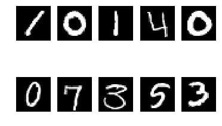
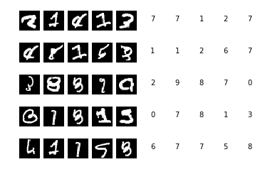

The purpose of this notebook is to work on the famous MNIST dataset (see [here](https://en.wikipedia.org/wiki/MNIST_database#Dataset)) for digit recognition. I'm going to use Keras library in Python for the convolutional neural network. 

Let's start with reading the training data.


```python
import pandas as pd
import numpy as np
np.random.seed(7)
```


```python
directory = '../../Datasets/Digital_Recognizer/'
train_input = pd.read_csv(directory + 'train.csv')
```


```python
train_target = train_input['label']
train_input.drop(['label'], axis=1, inplace=True)
```


```python
train_input = train_input.astype('float32')
train_input = train_input / 255.
train_input = train_input.values
```

We can take a look at the first 10 samples to better understand the problem.


```python
import matplotlib.pyplot as plt
import matplotlib.cm as cm

%matplotlib inline
f, axarr = plt.subplots(2, 5)
for i in range(0,2):
    for j in range(0,5):
        axarr[i][j].imshow(train_input[i*5+j, :].reshape(28, 28), cmap=cm.Greys_r)
        axarr[i][j].axis('off')
```





The target array that we have includes a single number from 0 to 9. We need to convert that to categorical 0/1 values.


```python
train_target.shape
```


    (42000,)
```python
train_target[0:10]
```


    0    1
    1    0
    2    1
    3    4
    4    0
    5    0
    6    7
    7    3
    8    5
    9    3
    Name: label, dtype: int64


```python
from keras.utils.np_utils import to_categorical
train_target = to_categorical(train_target, 10)
```

    Using TensorFlow backend.
  


```python
train_target[0:10]
```


    array([[ 0.,  1.,  0.,  0.,  0.,  0.,  0.,  0.,  0.,  0.],
           [ 1.,  0.,  0.,  0.,  0.,  0.,  0.,  0.,  0.,  0.],
           [ 0.,  1.,  0.,  0.,  0.,  0.,  0.,  0.,  0.,  0.],
           [ 0.,  0.,  0.,  0.,  1.,  0.,  0.,  0.,  0.,  0.],
           [ 1.,  0.,  0.,  0.,  0.,  0.,  0.,  0.,  0.,  0.],
           [ 1.,  0.,  0.,  0.,  0.,  0.,  0.,  0.,  0.,  0.],
           [ 0.,  0.,  0.,  0.,  0.,  0.,  0.,  1.,  0.,  0.],
           [ 0.,  0.,  0.,  1.,  0.,  0.,  0.,  0.,  0.,  0.],
           [ 0.,  0.,  0.,  0.,  0.,  1.,  0.,  0.,  0.,  0.],
           [ 0.,  0.,  0.,  1.,  0.,  0.,  0.,  0.,  0.,  0.]])


Now, let's do the normal training/validation set split. I'll use 20% of the training data to be used for validation.


```python
from sklearn.model_selection import train_test_split
X_train, X_cv, y_train, y_cv = train_test_split(train_input, train_target, test_size=0.20, random_state=0)
```

I'll use dropout for regulation. Also, we need to change the shape of input array for the convNN (see below).


```python
batch_size = 256

epochs = 20
dropout = 0.05
num_classes = 10

X_train = X_train.reshape(-1, 28, 28, 1)
X_cv = X_cv.reshape(-1, 28, 28, 1)
input_shape = (28, 28, 1)
```


```python
from keras.models import Sequential
from keras.layers import Dense, Dropout, Flatten
from keras.layers import Conv2D, MaxPooling2D, BatchNormalization

model = Sequential()

model.add(Conv2D(filters=32, kernel_size=(3, 3), activation='relu', input_shape=input_shape))
model.add(Conv2D(filters=32, kernel_size=(3, 3), activation='relu'))
model.add(MaxPooling2D())
model.add(Dropout(dropout))

model.add(Conv2D(filters=64, kernel_size=(3, 3), activation='relu'))
model.add(Conv2D(filters=64, kernel_size=(3, 3), activation='relu'))
model.add(MaxPooling2D())
model.add(Dropout(dropout))

model.add(Flatten())
model.add(Dense(512, activation='relu'))
model.add(Dropout(dropout))
model.add(Dense(10, activation='softmax'))
```

The above model is a normal Conv2D architecture. We can fine tune it later to improve the accuracy. 


```python
model.summary()
```

    _________________________________________________________________
    Layer (type)                 Output Shape              Param #   
    =================================================================
    conv2d_1 (Conv2D)            (None, 26, 26, 32)        320       
    _________________________________________________________________
    conv2d_2 (Conv2D)            (None, 24, 24, 32)        9248      
    _________________________________________________________________
    max_pooling2d_1 (MaxPooling2 (None, 12, 12, 32)        0         
    _________________________________________________________________
    dropout_1 (Dropout)          (None, 12, 12, 32)        0         
    _________________________________________________________________
    conv2d_3 (Conv2D)            (None, 10, 10, 64)        18496     
    _________________________________________________________________
    conv2d_4 (Conv2D)            (None, 8, 8, 64)          36928     
    _________________________________________________________________
    max_pooling2d_2 (MaxPooling2 (None, 4, 4, 64)          0         
    _________________________________________________________________
    dropout_2 (Dropout)          (None, 4, 4, 64)          0         
    _________________________________________________________________
    flatten_1 (Flatten)          (None, 1024)              0         
    _________________________________________________________________
    dense_1 (Dense)              (None, 512)               524800    
    _________________________________________________________________
    dropout_3 (Dropout)          (None, 512)               0         
    _________________________________________________________________
    dense_2 (Dense)              (None, 10)                5130      
    =================================================================
    Total params: 594,922
    Trainable params: 594,922
    Non-trainable params: 0
    _________________________________________________________________


```python
from keras.optimizers import RMSprop
model.compile(loss='categorical_crossentropy', optimizer=RMSprop(), metrics=['accuracy'])
```

The are several discussions (see [here](http://yann.lecun.com/exdb/mnist/index.html) about using elastic distortion for data agumentation). I'm goint to try a simple one for now. There are many paramters that can be used for this purpose.


```python
from keras.preprocessing.image import ImageDataGenerator

datagen = ImageDataGenerator(zoom_range = 1,
                            rotation_range = 15)
```


```python
import keras
class LossHistory(keras.callbacks.Callback):
    def on_train_begin(self, logs={}):
        self.losses = []

    def on_batch_end(self, batch, logs={}):
        self.losses.append(logs.get('loss'))
history = LossHistory()       
model.fit_generator(datagen.flow(X_train, y_train, batch_size=batch_size),
                           steps_per_epoch=len(X_train)//batch_size,
                           epochs=epochs,
                           verbose=2,
                           validation_data=(X_cv,y_cv), callbacks=[history])
```

    Epoch 1/20
    103s - loss: 1.0792 - acc: 0.6418 - val_loss: 0.1841 - val_acc: 0.9514
    Epoch 2/20
    102s - loss: 0.6211 - acc: 0.7940 - val_loss: 0.0948 - val_acc: 0.9719
    Epoch 3/20
    100s - loss: 0.5188 - acc: 0.8269 - val_loss: 0.0886 - val_acc: 0.9730
    Epoch 4/20
    99s - loss: 0.4700 - acc: 0.8420 - val_loss: 0.0739 - val_acc: 0.9792
    Epoch 5/20
    100s - loss: 0.4254 - acc: 0.8556 - val_loss: 0.0678 - val_acc: 0.9790
    Epoch 6/20
    100s - loss: 0.4120 - acc: 0.8624 - val_loss: 0.0500 - val_acc: 0.9843
    Epoch 7/20
    99s - loss: 0.3840 - acc: 0.8724 - val_loss: 0.0585 - val_acc: 0.9808
    Epoch 8/20
    100s - loss: 0.3733 - acc: 0.8760 - val_loss: 0.0376 - val_acc: 0.9881
    Epoch 9/20
    101s - loss: 0.3598 - acc: 0.8784 - val_loss: 0.0377 - val_acc: 0.9876
    Epoch 10/20
    100s - loss: 0.3502 - acc: 0.8810 - val_loss: 0.0384 - val_acc: 0.9876
    Epoch 11/20
    100s - loss: 0.3305 - acc: 0.8878 - val_loss: 0.0302 - val_acc: 0.9898
    Epoch 12/20
    101s - loss: 0.3290 - acc: 0.8870 - val_loss: 0.0413 - val_acc: 0.9863
    Epoch 13/20
    100s - loss: 0.3226 - acc: 0.8907 - val_loss: 0.0300 - val_acc: 0.9907
    Epoch 14/20
    101s - loss: 0.3211 - acc: 0.8920 - val_loss: 0.0339 - val_acc: 0.9880
    Epoch 15/20
    101s - loss: 0.3148 - acc: 0.8923 - val_loss: 0.0305 - val_acc: 0.9895
    Epoch 16/20
    101s - loss: 0.3069 - acc: 0.8959 - val_loss: 0.0252 - val_acc: 0.9915
    Epoch 17/20
    103s - loss: 0.2950 - acc: 0.9017 - val_loss: 0.0234 - val_acc: 0.9932
    Epoch 18/20
    104s - loss: 0.3014 - acc: 0.8977 - val_loss: 0.0248 - val_acc: 0.9926
    Epoch 19/20
    105s - loss: 0.2963 - acc: 0.8980 - val_loss: 0.0233 - val_acc: 0.9917
    Epoch 20/20
    105s - loss: 0.2897 - acc: 0.9015 - val_loss: 0.0249 - val_acc: 0.9914


    <keras.callbacks.History at 0x3a9514e0>


```python
# check the wrong images
p_cv = np.round(model.predict(X_cv)).argmax(axis=1)
wrong_pixels = X_cv[p_cv != y_cv.argmax(axis=1)]
print('[CV]: number of wrong items is:', len(wrong_pixels), 'out of', len(X_cv))
```

    [CV]: number of wrong items is: 76 out of 8400
​    


```python
f, axarr = plt.subplots(5, 10)
for i in range(0, 5):
    for j in range(0, 5):
        idx = np.random.randint(0, wrong_pixels.shape[0])
        axarr[i][j].imshow(wrong_pixels[idx, :].reshape(28, 28), cmap=cm.Greys_r)
        title = str(model.predict(wrong_pixels[idx, :].reshape(1, 28, 28, 1)).argmax())
        axarr[i][j + 5].text(0.5, 0.5, title)
        axarr[i][j].axis('off')
        axarr[i][j + 5].axis('off')

plt.show()
```





The accuracy of the trained model is 99.14% which is very good given the fact that we can increase epochs and also we can improve the architecture of the conv network and the elastic distortion parameters.  
