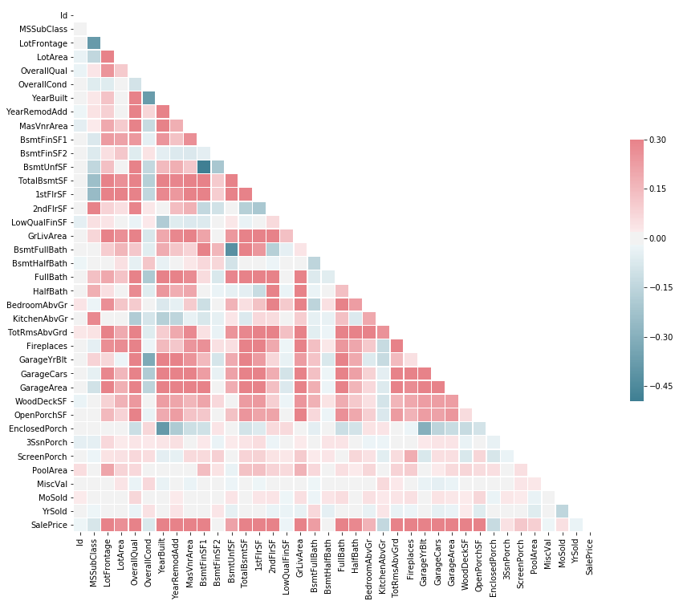
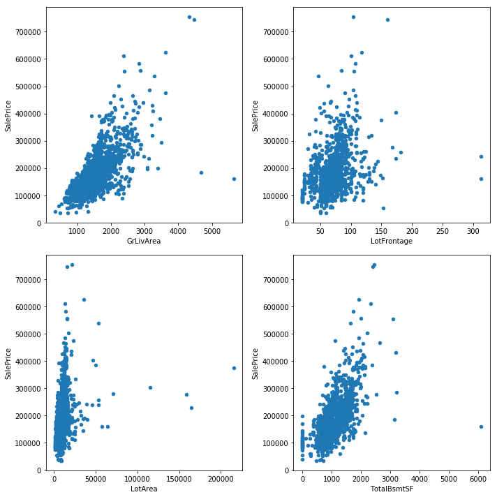
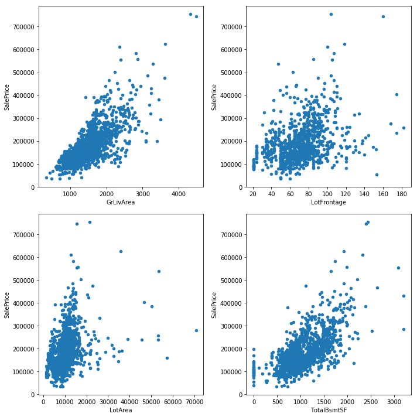

Here, the goal is to investigate [Kaggle's House Price competition](https://www.kaggle.com/c/house-prices-advanced-regression-techniques). I try different regression models inclduing boosting methods (see [here](https://en.wikipedia.org/wiki/Boosting_(machine_learning)) based on sklearn package. 


```python
import pandas as pd
import matplotlib.pyplot as plt
%matplotlib inline  

directory = '../../Datasets/House_Price/'
train_input = pd.read_csv(directory+'train.csv')
test_input = pd.read_csv(directory+'test.csv')
test_ID = test_input['Id']
```

### Correlation between columns

First, let's generate a heatmap to evaluate the correlation between Sale Price and other paramters. Clearly, some paramters such as LotArea and LotFrontage are very important and they are highly correclated with the final Sale Price.


```python
# generate a headmap for features in a data frame
import seaborn as sns
import numpy as np
corr = train_input.corr()
# Generate a mask for the upper triangle
mask = np.zeros_like(corr, dtype=np.bool)
mask[np.triu_indices_from(mask)] = True
f, ax = plt.subplots(figsize=(15, 12))

# Generate a custom diverging colormap
cmap = sns.diverging_palette(220, 10, as_cmap=True)
sns.heatmap(train_input.corr(), mask=mask, cmap=cmap, vmax=.3, center=0,
            square=True, linewidths=.5, cbar_kws={"shrink": .5})
```


    <matplotlib.axes._subplots.AxesSubplot at 0x9839f98>





### Removing outliers


```python
hsize = 2
wsize = 2
f, ax = plt.subplots(hsize,wsize,figsize=[10, 10])
columns = ['GrLivArea', 'LotFrontage', 'LotArea', 'TotalBsmtSF']
for i in range(0,hsize):
    for j in range(0,wsize):
        train_input.plot.scatter(columns[i*wsize+j],'SalePrice', ax=ax[i][j], title=None)
plt.tight_layout() 
```





```python
train_input.shape
```


    (1460, 81)


```python
train_input = train_input.drop(train_input[(train_input['GrLivArea']>4000) & (train_input['SalePrice']<300000)].index)
train_input = train_input.drop(train_input[(train_input['LotFrontage']>300) & (train_input['SalePrice']<300000)].index)
train_input = train_input.drop(train_input[(train_input['LotArea']>100000) & (train_input['SalePrice']<400000)].index)
train_input.shape
```


    (1453, 81)


```python
hsize = 2
wsize = 2
f, ax = plt.subplots(hsize,wsize,figsize=[10, 10])
columns = ['GrLivArea', 'LotFrontage', 'LotArea', 'TotalBsmtSF']
for i in range(0,hsize):
    for j in range(0,wsize):
        train_input.plot.scatter(columns[i*wsize+j],'SalePrice', ax=ax[i][j], title=None)
plt.tight_layout() 
```





### Rescaling target values


```python
import numpy as np
train_input["SalePrice"] = np.log1p(train_input["SalePrice"])
```

### Filling missing data


```python
ntrain = train_input.shape[0]
ntest = test_input.shape[0]
test_input['SalePrice'] = 0
all_data = pd.concat((train_input, test_input)).reset_index(drop=True)
print("all_data size is : {}".format(all_data.shape))
```

    all_data size is : (2912, 81)
​    


```python
#all_data['LotFrontage'].fillna(all_data.LotFrontage.mean(), inplace=True)
all_data["LotFrontage"] = all_data.groupby("Neighborhood")["LotFrontage"].transform(
    lambda x: x.fillna(x.median()))

all_data['Alley'].fillna('NoAccess', inplace=True)

all_data['BsmtQual'].fillna('NoBsmt', inplace=True)
all_data['BsmtCond'].fillna('NoBsmt', inplace=True)
all_data['BsmtExposure'].fillna('NoBsmt', inplace=True)
all_data['BsmtFinType1'].fillna('NoBsmt', inplace=True)
all_data['BsmtFinType2'].fillna('NoBsmt', inplace=True)
all_data['BsmtFullBath'].fillna(0, inplace=True)
all_data['BsmtHalfBath'].fillna(0, inplace=True)
all_data['BsmtFinSF1'].fillna(0, inplace=True)
all_data['BsmtFinSF2'].fillna(0, inplace=True)
all_data['BsmtUnfSF'].fillna(0, inplace=True)
all_data['TotalBsmtSF'].fillna(0, inplace=True)

all_data['FireplaceQu'].fillna('NoFireplace', inplace=True)

all_data['GarageType'].fillna('NoGarage', inplace=True)
all_data['GarageFinish'].fillna('NoGarage', inplace=True)
all_data['GarageQual'].fillna('NoGarage', inplace=True)
all_data['GarageCond'].fillna('NoGarage', inplace=True)
all_data['GarageYrBlt'].fillna(0, inplace=True)
all_data['GarageCars'].fillna(0, inplace=True)
all_data['GarageArea'].fillna(0, inplace=True)

all_data['MasVnrType'].fillna((all_data['MasVnrType']).mode()[0], inplace=True)
all_data['MasVnrArea'].fillna(0, inplace=True)

all_data['PoolQC'].fillna('NoPool', inplace=True)

all_data['Electrical'].fillna((all_data['Electrical']).mode()[0], inplace=True)

all_data['Fence'].fillna('NoFence', inplace=True)

all_data['GarageYrBlt'] = all_data['GarageYrBlt'].astype('int64')

all_data['KitchenQual'].fillna((all_data['KitchenQual']).mode()[0], inplace=True)

all_data['MiscFeature'].fillna((all_data['MiscFeature']).mode()[0], inplace=True)

all_data['Utilities'].fillna((all_data['Utilities']).mode()[0], inplace=True)

all_data['Functional'].fillna((all_data['Functional']).mode()[0], inplace=True)

all_data['MSZoning'].fillna((all_data['MSZoning']).mode()[0], inplace=True)

all_data['Exterior1st'].fillna((all_data['Exterior1st']).mode()[0], inplace=True)
all_data['Exterior2nd'].fillna((all_data['Exterior2nd']).mode()[0], inplace=True)
all_data['SaleType'].fillna((all_data['SaleType']).mode()[0], inplace=True)
```


```python
all_data['MSSubClass'] = all_data['MSSubClass'].apply(str)
all_data['OverallCond'] = all_data['OverallCond'].astype(str)
all_data['YrSold'] = all_data['YrSold'].astype(str)
all_data['MoSold'] = all_data['MoSold'].astype(str)
```

### Changing some numeric features to categorical features


```python
all_data.drop(['Id'], axis=1, inplace=True)
all_data.drop(['Utilities'], axis=1, inplace=True)

for col in all_data.columns:
    if str(all_data[col].dtype)=='object':
        all_data[col]= all_data[col].astype('category')
```

### Adding a new feature


```python
all_data['TotalSF'] = all_data['TotalBsmtSF'] + all_data['1stFlrSF'] + all_data['2ndFlrSF']
print('Shape dataset: {}'.format(all_data.shape))
```

    Shape dataset: (2912, 80)
​    

### Finding numerical and categorical features


```python
categorical_features = all_data.select_dtypes(include = ["category"]).columns
numerical_features = all_data.select_dtypes(include = ["int64", "float64"]).columns
numerical_features = list(set(numerical_features) - set(['SalePrice']))
print("Numerical features : " + str(len(numerical_features)))
print("Categorical features : " + str(len(categorical_features)))
```

    Numerical features : 33
    Categorical features : 46


```python
categorical_features
```


    Index(['MSSubClass', 'MSZoning', 'Street', 'Alley', 'LotShape', 'LandContour',
           'LotConfig', 'LandSlope', 'Neighborhood', 'Condition1', 'Condition2',
           'BldgType', 'HouseStyle', 'OverallCond', 'RoofStyle', 'RoofMatl',
           'Exterior1st', 'Exterior2nd', 'MasVnrType', 'ExterQual', 'ExterCond',
           'Foundation', 'BsmtQual', 'BsmtCond', 'BsmtExposure', 'BsmtFinType1',
           'BsmtFinType2', 'Heating', 'HeatingQC', 'CentralAir', 'Electrical',
           'KitchenQual', 'Functional', 'FireplaceQu', 'GarageType',
           'GarageFinish', 'GarageQual', 'GarageCond', 'PavedDrive', 'PoolQC',
           'Fence', 'MiscFeature', 'MoSold', 'YrSold', 'SaleType',
           'SaleCondition'],
          dtype='object')


### Adding polynomial features


```python
from sklearn.preprocessing import LabelEncoder
for c in categorical_features:
    lbl = LabelEncoder()
    lbl.fit(list(all_data[c].values)) 
    all_data[c] = lbl.transform(list(all_data[c].values))
    all_data[c] = all_data[c].astype('category')
```


```python
all_data.shape
```


    (2912, 80)


```python
poly_features = ['BedroomAbvGr', 'KitchenAbvGr','LotFrontage', 'GarageCars', 
                 'FullBath', 'Fireplaces']

new_numerical_features = set(numerical_features)
for c1 in range(0,len(poly_features)):
    for c2 in range(0,c1):
        for c3 in range(0,c2):                
            c11, c12, c13 = poly_features[c1], poly_features[c2], poly_features[c3]
            all_data[str(c11)+'_'+str(c12)+'_'+str(c13)] = all_data[c11] * all_data[c12] * all_data[c13]
            new_numerical_features.add(str(c11)+'_'+str(c12)+'_'+str(c13))
new_numerical_features = list(new_numerical_features)
all_data.shape
```


    (2912, 100)


```python
numerical_features = new_numerical_features
```

### Handling skewness in the features


```python
from scipy.stats import skew

# Check the skew of all numerical features
skewed_feats = all_data[numerical_features].apply(lambda x: skew(x)).sort_values(ascending=False)
print("\nSkew in numerical features: \n")
skewness = pd.DataFrame({'Skew' :skewed_feats})
skewness.head(20)
```

    

```python
skewness = skewness[abs(skewness) > 0.25]
print("There are {} skewed numerical features to Box Cox transform".format(skewness.shape[0]))

from scipy.special import boxcox1p
skewed_features = skewness.index
lam = 0.15
for feat in skewed_features:
    #all_data[feat] += 1
    all_data[feat] = boxcox1p(all_data[feat], lam) 
```

    There are 53 skewed numerical features to Box Cox transform
​    

### Creating boolean features for categorical features


```python
print(all_data.shape)
all_data = pd.get_dummies(all_data)
print(all_data.shape)
```

    (2912, 100)
    (2912, 358)


### Recovering test & train data


```python
train_input = all_data[:ntrain]
test_input = all_data[ntrain:]
```

### Evaluating feature correlation 


```python
# Find most important features relative to target
print("Find most important features relative to target")
corr = train_input.corr()
corr.sort_values(["SalePrice"], ascending = False, inplace = True)
print(corr.SalePrice[1:30])
```

    Find most important features relative to target
    TotalSF                                 0.821972
    OverallQual                             0.810329
    GrLivArea                               0.737239
    FullBath_GarageCars_BedroomAbvGr        0.682735
    FullBath_GarageCars_LotFrontage         0.675831
    Fireplaces_FullBath_GarageCars          0.662791
    FullBath_GarageCars_KitchenAbvGr        0.662072
    GarageCars                              0.650821
    1stFlrSF                                0.615296
    Fireplaces_GarageCars_KitchenAbvGr      0.615245
    Fireplaces_GarageCars_BedroomAbvGr      0.602258
    Fireplaces_GarageCars_LotFrontage       0.597084
    YearBuilt                               0.588222
    FullBath                                0.583229
    Fireplaces_FullBath_KitchenAbvGr        0.582335
    Fireplaces_FullBath_BedroomAbvGr        0.576186
    Fireplaces_FullBath_LotFrontage         0.575409
    GarageCars_LotFrontage_BedroomAbvGr     0.568901
    YearRemodAdd                            0.568170
    GarageCars_LotFrontage_KitchenAbvGr     0.565534
    GarageCars_KitchenAbvGr_BedroomAbvGr    0.544156
    TotRmsAbvGrd                            0.543126
    Foundation_2                            0.537668
    Fireplaces_LotFrontage_KitchenAbvGr     0.533499
    Fireplaces_LotFrontage_BedroomAbvGr     0.530877
    FullBath_LotFrontage_BedroomAbvGr       0.529754
    ExterQual_2                             0.513639
    GarageArea                              0.509966
    FullBath_LotFrontage_KitchenAbvGr       0.506875
    Name: SalePrice, dtype: float64


```python
train_target = train_input['SalePrice'].astype(float)

train_input.is_copy = False
test_input.is_copy = False
train_input.drop(labels=['SalePrice'], axis=1, inplace=True)
test_input.drop(labels=['SalePrice'], axis=1, inplace=True)
```


```python
X_train, y_train = train_input, train_target
```

### Trying base and ensemble regression models


```python
from sklearn.linear_model import ElasticNet, Lasso, LassoCV
from sklearn.ensemble import RandomForestRegressor, GradientBoostingRegressor, AdaBoostRegressor
from sklearn.kernel_ridge import KernelRidge
from sklearn.pipeline import make_pipeline
from sklearn.preprocessing import MinMaxScaler
from sklearn.base import BaseEstimator, TransformerMixin, RegressorMixin, clone
from sklearn.model_selection import KFold, cross_val_score
from sklearn.metrics import mean_squared_error
from sklearn.model_selection import GridSearchCV
import lightgbm as lgb
```


```python
#Validation function
n_folds = 5
cv = KFold(n_folds, shuffle=True, random_state=42).get_n_splits(X_train.values)
```


```python
def root_mse(y, y_pred):
    return np.sqrt(mean_squared_error(y, y_pred))
```


```python
lasso = make_pipeline(MinMaxScaler(), Lasso(random_state=1, max_iter=2000))

param_grid = [{'lasso__alpha': np.linspace(0.0001, 0.001, 15)}]
gs_lasso = GridSearchCV(lasso, param_grid, scoring='neg_mean_squared_error', verbose=1, cv = cv, n_jobs=-1)
gs_lasso.fit(X_train, y_train)
print('Lasso best score: {} \nLasso best params: {}'.format(np.sqrt(-gs_lasso.best_score_), gs_lasso.best_params_))
```

    Fitting 5 folds for each of 15 candidates, totalling 75 fits
​    

    [Parallel(n_jobs=-1)]: Done  34 tasks      | elapsed:    8.7s
    [Parallel(n_jobs=-1)]: Done  75 out of  75 | elapsed:   10.2s finished


    Lasso best score: 0.11146179161665995 
    Lasso best params: {'lasso__alpha': 0.00035714285714285714}


```python
ENet = make_pipeline(MinMaxScaler(), ElasticNet(random_state=1))

param_grid = [{'elasticnet__alpha': np.linspace(0.0004, 0.001, 15),
              'elasticnet__l1_ratio': (0.98, 0.95, 0.9)}]
gs_enet = GridSearchCV(ENet, param_grid, scoring='neg_mean_squared_error', verbose=1, cv = cv, n_jobs=-1)
gs_enet.fit(X_train, y_train)
print('ElasticNet best score: {} \nElasticNetbest params: {}'.format(np.sqrt(-gs_enet.best_score_), gs_enet.best_params_))
```

    Fitting 5 folds for each of 45 candidates, totalling 225 fits
​    

    [Parallel(n_jobs=-1)]: Done  34 tasks      | elapsed:    7.6s
    [Parallel(n_jobs=-1)]: Done 184 tasks      | elapsed:   14.2s
    [Parallel(n_jobs=-1)]: Done 225 out of 225 | elapsed:   15.7s finished


    ElasticNet best score: 0.1114782238196748 
    ElasticNetbest params: {'elasticnet__alpha': 0.00040000000000000002, 'elasticnet__l1_ratio': 0.98}


```python
KRR = make_pipeline(MinMaxScaler(), KernelRidge(kernel='polynomial', coef0=2.5))

param_grid = [{'kernelridge__alpha': np.linspace(0.01, 0.9, 20),
              'kernelridge__degree': (4, 5, 6)}]
gs_krr = GridSearchCV(KRR, param_grid, scoring='neg_mean_squared_error', verbose=1, cv = cv, n_jobs=-1)
gs_krr.fit(X_train, y_train)
print('KernelRidge best score: {} \nKernelRidge best params: {}'.format(np.sqrt(-gs_krr.best_score_), gs_krr.best_params_))
```

    Fitting 5 folds for each of 60 candidates, totalling 300 fits
​    

    [Parallel(n_jobs=-1)]: Done  34 tasks      | elapsed:   12.2s
    [Parallel(n_jobs=-1)]: Done 184 tasks      | elapsed:   37.7s
    [Parallel(n_jobs=-1)]: Done 300 out of 300 | elapsed:   58.4s finished


    KernelRidge best score: 0.11599661241822305 
    KernelRidge best params: {'kernelridge__alpha': 0.38473684210526315, 'kernelridge__degree': 4}


```python
GBoost = make_pipeline(MinMaxScaler(), GradientBoostingRegressor(max_features='sqrt',random_state=1))

param_grid = [{'gradientboostingregressor__n_estimators': (2000, 3000, 4000, 5000),
              'gradientboostingregressor__learning_rate': (0.0025, 0.005, 0.008),
              'gradientboostingregressor__max_depth': (3, 4, 5)}]
gs_gboost = GridSearchCV(GBoost, param_grid, scoring='neg_mean_squared_error', verbose=1, cv = cv, n_jobs=-1)
gs_gboost.fit(X_train, y_train)
print('GradientBoostingRegressor best score: {} \nGradientBoostingRegressor best params: {}'.format(np.sqrt(-gs_gboost.best_score_), gs_gboost.best_params_))
```

    Fitting 5 folds for each of 36 candidates, totalling 180 fits
​    

    [Parallel(n_jobs=-1)]: Done  34 tasks      | elapsed:   32.1s
    [Parallel(n_jobs=-1)]: Done 180 out of 180 | elapsed:  2.8min finished


    GradientBoostingRegressor best score: 0.11423047685506897 
    GradientBoostingRegressor best params: {'gradientboostingregressor__learning_rate': 0.008, 'gradientboostingregressor__max_depth': 3, 'gradientboostingregressor__n_estimators': 5000}


```python
model_lgb = make_pipeline(MinMaxScaler(), 
                          lgb.LGBMRegressor(objective='regression', random_state=1))

param_grid = [{'lgbmregressor__n_estimators': (3000, 4000, 5000, 6000),
              'lgbmregressor__learning_rate': (0.005, 0.008),
              'lgbmregressor__num_leaves': (3, 4, 5)}]
gs_lgb = GridSearchCV(model_lgb, param_grid, scoring='neg_mean_squared_error', verbose=1, cv = cv, n_jobs=-1)
gs_lgb.fit(X_train, y_train)
print('LGBMRegressor best score: {} \nLGBMRegressor best params: {}'.format(np.sqrt(-gs_lgb.best_score_),gs_lgb.best_params_))
```

    Fitting 5 folds for each of 24 candidates, totalling 120 fits
​    

    [Parallel(n_jobs=-1)]: Done  34 tasks      | elapsed:  1.4min
    [Parallel(n_jobs=-1)]: Done 120 out of 120 | elapsed:  5.5min finished


    LGBMRegressor best score: 0.12113175909927536 
    LGBMRegressor best params: {'lgbmregressor__learning_rate': 0.008, 'lgbmregressor__n_estimators': 5000, 'lgbmregressor__num_leaves': 3}


```python
model_rforest = make_pipeline(MinMaxScaler(), RandomForestRegressor(random_state=1))

param_grid = [{'randomforestregressor__n_estimators': (2000, 3000, 4000),
              'randomforestregressor__max_depth': (3, 4, 5)}]
gs_rforest = GridSearchCV(model_rforest, param_grid, verbose=1, scoring='neg_mean_squared_error', cv = cv, n_jobs=-1)
gs_rforest.fit(X_train, y_train)
print('RandomForestRegressor best score: {} \nRandomForestRegressor best params: {}'.format(np.sqrt(-gs_rforest.best_score_), gs_rforest.best_params_))
```

    Fitting 5 folds for each of 9 candidates, totalling 45 fits
​    

    [Parallel(n_jobs=-1)]: Done  45 out of  45 | elapsed:  6.2min finished
​    

    RandomForestRegressor best score: 0.15266978051619642 
    RandomForestRegressor best params: {'randomforestregressor__max_depth': 5, 'randomforestregressor__n_estimators': 3000}


```python
model_adaboost = make_pipeline(MinMaxScaler(), AdaBoostRegressor(random_state=1))

param_grid = [{'adaboostregressor__n_estimators': (1000, 2000, 3000, 4000)}]
gs_aboost = GridSearchCV(model_adaboost, param_grid, verbose=1, scoring='neg_mean_squared_error', cv = cv, n_jobs=-1)
gs_aboost.fit(X_train, y_train)
print('AdaBoostRegressor best score: {} \nAdaBoostRegressor best params: {}'.format(np.sqrt(-gs_aboost.best_score_), gs_aboost.best_params_))
```

    Fitting 5 folds for each of 4 candidates, totalling 20 fits
​    

    [Parallel(n_jobs=-1)]: Done  20 out of  20 | elapsed:  3.0min finished
​    

    AdaBoostRegressor best score: 0.16419197205003744 
    AdaBoostRegressor best params: {'adaboostregressor__n_estimators': 3000}


### Creating models based on the best reported params


```python
lasso = make_pipeline(MinMaxScaler(), Lasso(random_state=1, 
                                            max_iter=2000, 
                                           alpha=gs_lasso.best_params_['lasso__alpha']))

ENet = make_pipeline(MinMaxScaler(), ElasticNet(random_state=1, 
                                               alpha = gs_enet.best_params_['elasticnet__alpha'],
                                               l1_ratio = gs_enet.best_params_['elasticnet__l1_ratio']))

KRR = make_pipeline(MinMaxScaler(), KernelRidge(kernel='polynomial', 
                                                coef0=2.5,
                                               alpha=gs_krr.best_params_['kernelridge__alpha'],
                                               degree=gs_krr.best_params_['kernelridge__degree']))


model_lgb = make_pipeline(MinMaxScaler(), lgb.LGBMRegressor(objective='regression',
                                                           learning_rate =gs_lgb.best_params_['lgbmregressor__learning_rate'],
                                                           n_estimators =gs_lgb.best_params_['lgbmregressor__n_estimators'],
                                                           num_leaves =gs_lgb.best_params_['lgbmregressor__num_leaves'],
                                                            random_state=1))
GBoost = make_pipeline(MinMaxScaler(), GradientBoostingRegressor(max_features='sqrt',
                                                                 learning_rate=gs_gboost.best_params_['gradientboostingregressor__learning_rate'], 
                                                                 max_depth=gs_gboost.best_params_['gradientboostingregressor__max_depth'],
                                                                 n_estimators=gs_gboost.best_params_['gradientboostingregressor__n_estimators'],
                                                                 random_state=1))

model_adaboost = make_pipeline(MinMaxScaler(), AdaBoostRegressor(random_state=1, 
                                                                n_estimators=gs_aboost.best_params_['adaboostregressor__n_estimators']))

model_rforest = make_pipeline(MinMaxScaler(), 
                              RandomForestRegressor(random_state=1,
                             n_estimators=gs_rforest.best_params_['randomforestregressor__n_estimators'],
                             max_depth=gs_rforest.best_params_['randomforestregressor__max_depth']))
```

### Stacking different models


```python
from mlxtend.regressor import StackingRegressor

stregr = StackingRegressor(regressors=[lasso, model_lgb, GBoost, ENet], 
                           meta_regressor=lasso)

print(root_mse(y_train, stregr.fit(X_train, y_train).predict(X_train)))
```

    0.0538026372684
 
