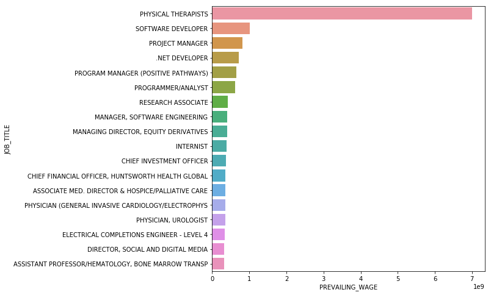

Here, I investigate the H-1B visa petitions. H-1B is an employment-based, non-immigrant visa category for temporary foreign workers in the United States. The data can be accessed [here at Kaggle's website](https://www.kaggle.com/nsharan/h-1b-visa).

The database includes the following information:

- **CASE_STATUS**: Case Status: “Certified,” “Certified-Withdrawn,” Denied,” and “Withdrawn”.
- **EMPLOYER_NAME**: Name of employer submitting application.
- **SOC_NAME**: Occupational name associated with the SOC_CODE. 
- **JOB_TITLE**: Job title
- **FULL_TIME_POSITION**: Y = Full Time Position; N = Part Time Position
- **PREVAILING_WAGE**: Prevailing Wage for the job being requested for temporary labor condition. The wage is listed at annual scale in USD. 
- **YEAR**: Year in which the petition was filed
- **WORKSITE**: City and State information of the foreign worker's intended area of employment
- **lon**: longitude of the Worksite
- **lat**: latitude of the Worksite

### Some questions to be answered:

- Which job titles are the most common ones for H1B visa petitions?
- What are the distributions of approved and denied petitions in different years and for different companies?
- Which employers have the most number of petitions for part-time jobs?
- Which states (or regions) have the most number of petitions?
- Which part of the US has the most Hardware/Software Engineer jobs? 
- Which industry has the most number of Data Scientist positions? 

```python
import pandas as pd
import numpy as np
import matplotlib.pyplot as plt
import seaborn as sns
%matplotlib inline  
```


```python
directory = '../../Datasets/H1B_Visa/'
h1b = pd.read_csv(directory + 'h1b_kaggle.csv')
```


```python
h1b.dropna(subset=['YEAR'], inplace=True)
h1b.isnull().sum()
```


    Unnamed: 0                 0
    CASE_STATUS                0
    EMPLOYER_NAME             46
    SOC_NAME               17721
    JOB_TITLE                 30
    FULL_TIME_POSITION         2
    PREVAILING_WAGE           72
    YEAR                       0
    WORKSITE                   0
    lon                   107242
    lat                   107242
    dtype: int64


```python
h1b['YEAR']= h1b['YEAR'].astype(int)
```

# Job titles that have the most number of petitions


```python
plt.figure(figsize=[8, 8])

h1b.groupby(['JOB_TITLE']).count().YEAR.nlargest(15).plot(kind='pie')
```


    <matplotlib.axes._subplots.AxesSubplot at 0x34403cf8>


```python
titles = ['POSTDOCTORAL RESEARCH FELLOW', 'SOFTWARE ENGINEER', 'PROGRAMMER ANALYST', 'COMPUTER PROGRAMMER', 'SOFTWARE DEVELOPER', 
         'HARDWARE ENGINEER', 'DATA SCIENTIST', 'PROJECT MANAGER', 'CEO', 'PHYSICAL THERAPISTS', 'RESEARCH ASSOCIATE',
         'DATA ENGINEER']
hsize = 3
wsize = 4
f, ax = plt.subplots(hsize,wsize,figsize=[10, 10])
for i in range(0,hsize):
    for j in range(0,wsize):
        h1b[h1b.JOB_TITLE==titles[i*wsize + j]].groupby('YEAR').count().JOB_TITLE.plot(ax=ax[i][j], title=titles[i*wsize + j])
plt.tight_layout() 
```


```python
plt.figure(figsize=[8, 8])
df=h1b[['JOB_TITLE', 'PREVAILING_WAGE']].nlargest(20, 'PREVAILING_WAGE').reset_index(drop=True)
sns.barplot(y='JOB_TITLE', x='PREVAILING_WAGE', data=df)
```


    <matplotlib.axes._subplots.AxesSubplot at 0xb611908>





# Analysis of Case Status


```python
df = h1b.groupby(['YEAR', 'CASE_STATUS'])['YEAR'].count().unstack('CASE_STATUS')
for col in df.columns:
    if col not in ['CERTIFIED', 'CERTIFIED-WITHDRAWN', 'DENIED', 'WITHDRAWN']:
        df.drop(col, axis=1, inplace=True)

df.plot(kind='bar', stacked=True, figsize=[8, 8])
```


    <matplotlib.axes._subplots.AxesSubplot at 0xbbf3198>


### Companies with the most 'DENIED' petitions


```python
plt.figure(figsize=[8, 8])
df = h1b[h1b.CASE_STATUS=='DENIED'].groupby('EMPLOYER_NAME')['YEAR'].count().nlargest(15).reset_index(name='counts')
sns.barplot(y="EMPLOYER_NAME", x="counts", data=df)
```


    <matplotlib.axes._subplots.AxesSubplot at 0x34092048>


### Companies with the most 'CERTIFIED' petitions


```python
plt.figure(figsize=[8, 8])
df = h1b[h1b.CASE_STATUS=='CERTIFIED'].groupby('EMPLOYER_NAME').count().YEAR.nlargest(15).reset_index(name='counts')
sns.barplot(y="EMPLOYER_NAME", x="counts", data=df)
```


    <matplotlib.axes._subplots.AxesSubplot at 0x341f4048>


### Companies with the most 'WITHDRAWN' petitions


```python
plt.figure(figsize=[8, 8])
df = h1b[h1b.CASE_STATUS=='WITHDRAWN'].groupby('EMPLOYER_NAME').count().YEAR.nlargest(15).reset_index(name='counts')
sns.barplot(y="EMPLOYER_NAME", x="counts", data=df)
```


    <matplotlib.axes._subplots.AxesSubplot at 0x35353630>


# FULL-TIME or PART-TIME?


```python
df = h1b.groupby(['YEAR', 'FULL_TIME_POSITION'])['YEAR'].count().unstack('FULL_TIME_POSITION')
df.plot(kind='bar', stacked=True, figsize=[8, 8])
```


    <matplotlib.axes._subplots.AxesSubplot at 0xbeb4ac8>


### Companies with the most number of part-time petitions


```python
plt.figure(figsize=[8, 8])
df=h1b[h1b.FULL_TIME_POSITION=='N'].groupby('EMPLOYER_NAME').count().YEAR.nlargest(15).reset_index(name='counts')
sns.barplot(y="EMPLOYER_NAME", x="counts", data=df)
```


    <matplotlib.axes._subplots.AxesSubplot at 0x34b919b0>


### Worksites with the most number of part-time petitions


```python

plt.figure(figsize=[8, 8])
h1b[h1b.FULL_TIME_POSITION=='N'].groupby('WORKSITE').count().YEAR.nlargest(15).reset_index(name='counts')
sns.barplot(y="EMPLOYER_NAME", x="counts", data=df)
```


    <matplotlib.axes._subplots.AxesSubplot at 0x59c14c50>


# Worksite distribution


```python
plt.figure(figsize=[10, 10])

h1b.groupby(['WORKSITE'])['YEAR'].count().nlargest(15).plot(kind='pie')
```


    <matplotlib.axes._subplots.AxesSubplot at 0xccf0e10>


```python
Sites = ['NEW YORK, NEW YORK', 'HOUSTON, TEXAS', 'SAN FRANCISCO, CALIFORNIA', 'ATLANTA, GEORGIA']
hsize = 2
wsize = 2
fig, ax = plt.subplots(figsize=[8, 8])
for i in range(0,hsize):
    for j in range(0,wsize):
        h1b[h1b.WORKSITE==Sites[i*wsize + j]].groupby('YEAR').agg('count').JOB_TITLE.plot(ax=ax)
ax.legend(Sites)
```


    <matplotlib.legend.Legend at 0xd156400>


```python
plt.figure(figsize=[8, 8])
df = h1b[h1b.JOB_TITLE=='HARDWARE ENGINEER'].groupby('WORKSITE').count().YEAR.nlargest(10).reset_index(name='counts')
sns.barplot(y="WORKSITE", x="counts", data=df)
```


    <matplotlib.axes._subplots.AxesSubplot at 0x2c3c66a0>


```python
plt.figure(figsize=[8, 8])
df = h1b[h1b.JOB_TITLE=='SOFTWARE ENGINEER'].groupby('WORKSITE').count().YEAR.nlargest(10).reset_index(name='counts')
sns.barplot(y="WORKSITE", x="counts", data=df)
```


    <matplotlib.axes._subplots.AxesSubplot at 0x2ca7f198>


```python
plt.figure(figsize=[8, 8])
df = h1b[h1b.JOB_TITLE=='DATA SCIENTIST'].groupby('WORKSITE').count().YEAR.nlargest(10).reset_index(name='counts')
sns.barplot(y="WORKSITE", x="counts", data=df)
```


    <matplotlib.axes._subplots.AxesSubplot at 0x2dd15128>


```python
plt.figure(figsize=[8, 8])
df = h1b[h1b.JOB_TITLE=='PROJECT MANAGER'].groupby('WORKSITE').count().YEAR.nlargest(10).reset_index(name='counts')
sns.barplot(y="WORKSITE", x="counts", data=df)
```


    <matplotlib.axes._subplots.AxesSubplot at 0x2d6d31d0>


# Job titles per employer


```python
plt.figure(figsize=[8, 8])
df = h1b[h1b.JOB_TITLE=='DATA SCIENTIST'].groupby('EMPLOYER_NAME').count().YEAR.nlargest(10).reset_index(name='counts')
sns.barplot(y="EMPLOYER_NAME", x="counts", data=df)
```


    <matplotlib.axes._subplots.AxesSubplot at 0x34b0ea58>


```python
plt.figure(figsize=[8, 8])
df = h1b[h1b.JOB_TITLE=='SOFTWARE ENGINEER'].groupby('EMPLOYER_NAME').count().YEAR.nlargest(10).reset_index(name='counts')
sns.barplot(y="EMPLOYER_NAME", x="counts", data=df)
```


    <matplotlib.axes._subplots.AxesSubplot at 0x2dde08d0>


```python
plt.figure(figsize=[8, 8])
df = h1b[h1b.JOB_TITLE=='HARDWARE ENGINEER'].groupby('EMPLOYER_NAME').count().YEAR.nlargest(10).reset_index(name='counts')
sns.barplot(y="EMPLOYER_NAME", x="counts", data=df)
```


    <matplotlib.axes._subplots.AxesSubplot at 0x369c8198>


# Locations of petitions


```python
from mpl_toolkits.basemap import Basemap
map = Basemap(llcrnrlon=-119,llcrnrlat=22,urcrnrlon=-64,urcrnrlat=49,
        projection='lcc',lat_1=33,lat_2=45,lon_0=-95, resolution='f')

map.drawmapboundary()
map.fillcontinents()
map.drawcountries()
map.drawstates()

x, y = map(list(h1b["lon"].astype(float)), list(h1b["lat"].astype(float)))
map.scatter(x,y,1,marker='o',color='red')
plt.show()
```


